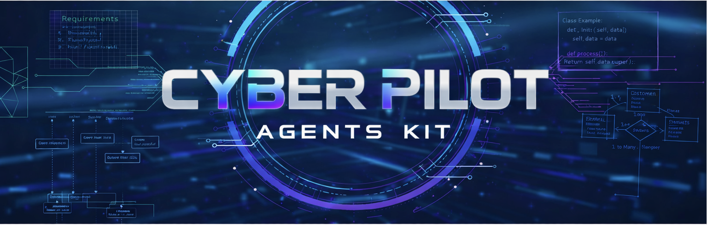

# <p align="center"></p>

[](LICENSE)
[]()
[]()
[]()

**Version**: 3.0 | **Status**: Active | **Language**: English

**Audience**: Developers using AI coding assistants, technical leads, engineering teams, DevOps engineers

## Cyber Pilot — Deterministic Agent Tool for Structured Workflows

Cypilot is a **deterministic agent tool** that embeds into AI coding assistants and CI pipelines to provide structured workflows, artifact validation, and design-to-code traceability.

Everything that can be validated, checked, or enforced without an LLM is handled by **deterministic scripts**; the LLM is reserved only for tasks that require reasoning, creativity, or natural language understanding.

## Problem

- **AI Agent Non-Determinism** — AI agents produce inconsistent results without structured guardrails; deterministic validation catches structural and traceability issues that LLMs miss or hallucinate
- **Design-Code Disconnect** — code diverges from design when there is no single source of truth and no automated traceability enforcement
- **Fragmented Tool Setup** — each AI agent (Windsurf, Cursor, Claude, Copilot) requires different file formats for skills, workflows, and rules; maintaining these manually is error-prone
- **Inconsistent PR Reviews** — code reviews vary in depth and focus without structured checklists and prompts
- **Manual Configuration Overhead** — project-specific conventions, artifact locations, and validation rules require manual setup and synchronization

## What Cypilot Provides

Two layers of functionality:

- **Core** — deterministic skill engine, generic workflows (generate/analyze), multi-agent integrations (Windsurf, Cursor, Claude, Copilot, OpenAI), global CLI (`cypilot`/`cpt`), config directory management, extensible kit system with blueprint-based resource generation, ID/traceability infrastructure, and Cypilot DSL (CDSL) for behavioral specifications
- **SDLC Kit** — artifact-first development pipeline (PRD → DESIGN → ADR → DECOMPOSITION → FEATURE → CODE) with templates, checklists, examples, deterministic validation, cross-artifact consistency checks, and GitHub PR review/status workflows

Works with any language, stack, or repository.

## Document Types

Cyber Pilot uses structured specification documents commonly used in modern SDLC:

- **BRD — Business Requirements Document**  
  Defines business goals, stakeholders, scope, and success metrics. Answers: *Why are we building this?*

- **PRD — Product Requirements Document**  
  Defines functional requirements, user stories, and acceptance criteria. Answers: *What should be built?*

- **ADR — Architecture Decision Record**  
  Captures architectural decisions, alternatives, rationale, and consequences. Answers: *Why was this technical decision made?*

- **DESIGN — Technical Design Document**  
  Describes system architecture, components, APIs, and implementation approach. Answers: *How will it be built?*

- **DECOMPOSITION — Task Decomposition Document**  
  Provides an executable plan with ordered FEATURE list, dependencies, and coverage links to PRD and DESIGN. Answers: *What are the steps to build it?*

- **FEATURE — Feature Specification Document**  
  Defines a specific feature's behavior, and integration points. Answers: *What exactly does this feature do?*

These documents create a traceable chain:
business intent (BRD) → product requirements (PRD) → architecture decisions and design (ADR + DESIGN) → executable plan (DECOMPOSITION) → implementable feature specs (FEATURE) → code.

---

## Table of Contents

- [Problem](#problem)
- [What Cypilot Provides](#what-cypilot-provides)
- [Document Types](#document-types)
- [Prerequisites](#prerequisites)
- [Installation](#installation)
- [Project Setup](#project-setup)
- [Using Cypilot](#using-cypilot)
  - [Example Prompts](#example-prompts)
  - [Agent Skill](#agent-skill)
  - [Workflow Commands](#workflow-commands)
  - [Checklists and Quality Gates](#checklists-and-quality-gates)
- [Architecture](#architecture)
  - [Directory Structure](#directory-structure)
  - [Blueprint System](#blueprint-system)
- [Extensibility](#extensibility)
  - [Kit: Cypilot SDLC](#kit-cypilot-sdlc)
- [Contributing](#contributing)

---

## Prerequisites

- **Python 3.11+** — required for the CLI tool and skill engine (uses `tomllib` from stdlib)
- **Git** — for project detection and version control
- **AI Agent** — Windsurf, Cursor, Claude Code, GitHub Copilot, or OpenAI Codex
- **`gh` CLI** (optional) — required only for PR review/status workflows
- **`pipx`** (recommended) — for global CLI installation

---

## Installation

### Global CLI (recommended)

```bash
pipx install git+https://github.com/cyberfabric/cyber-pilot.git
```

This installs `cypilot` and `cpt` commands globally. The CLI is a thin proxy shell — on first run it downloads the skill bundle into `~/.cypilot/cache/` and delegates all commands to the cached or project-local skill engine.

### Update

```bash
cypilot update
```

Updates `.core/` from cache, regenerates `.gen/` from user blueprints, and ensures `config/` scaffold integrity. User-editable files in `config/` are never overwritten.

---

## Project Setup

```bash
# Initialize Cypilot in your project
cypilot init

# Generate agent entry points for your IDE
cypilot agents --agent windsurf
```

`cypilot init` creates the Cypilot directory (default: `cypilot/`) with three subdirectories:

| Directory | Purpose | Editable? |
|-----------|---------|-----------|
| `.core/` | Read-only core files (skills, workflows, schemas, architecture, requirements) copied from cache | No |
| `.gen/` | Auto-generated files (SKILL.md, AGENTS.md, kit outputs, constraints) from blueprints | No |
| `config/` | User-editable config (`core.toml`, `artifacts.toml`, AGENTS.md, kit blueprints) | Yes |

The command also:
- Defines a root system (name/slug derived from the project directory)
- Creates `config/core.toml` and `config/artifacts.toml`
- Installs all available kits and generates resources from blueprints
- Injects a managed `<!-- @cpt:root-agents -->` block into the root `AGENTS.md`

Supported agents: `windsurf`, `cursor`, `claude`, `copilot`, `openai`.

## Using Cypilot

Start requests with `cypilot` in your AI agent chat. This switches the agent into Cypilot mode: it loads config and rules, routes the request to the right workflow (analyze vs generate), and gates file writes behind explicit confirmation.

```
cypilot on            — enable Cypilot mode
cypilot off           — disable Cypilot mode
cypilot auto-config   — scan project and generate convention rules
```

A full walkthrough is available in [`guides/STORY.md`](guides/STORY.md).

### Example Prompts

**Setup & Configuration**

| Prompt | What the agent does |
|--------|---------------------|
| `cypilot init` | Initializes Cypilot — creates config directory, generates rules, injects root AGENTS.md |
| `cypilot auto-config` | Scans project structure and generates per-system convention rules |
| `cypilot show config` | Displays config structure, registered artifacts, and codebase mappings |
| `cypilot agents --agent windsurf` | Regenerates agent entry points for a specific agent |

**Artifact Generation**

| Prompt | What the agent does |
|--------|---------------------|
| `cypilot make PRD for user authentication system` | Generates PRD with actors, requirements, flows following the template |
| `cypilot make DESIGN from PRD.md` | Transforms PRD into architecture design with full traceability |
| `cypilot decompose auth feature into tasks` | Creates DECOMPOSITION with ordered, dependency-mapped implementation units |
| `cypilot make FEATURE for login flow` | Produces feature design with acceptance criteria, CDSL flows, edge cases |

**Validation & Quality**

| Prompt | What the agent does |
|--------|---------------------|
| `cypilot validate PRD.md` | Runs deterministic template validation + semantic quality scoring |
| `cypilot validate all` | Validates entire artifact hierarchy, checks cross-references, reports issues |
| `cypilot validate code for auth module` | Scans code for `@cpt-*` markers, verifies coverage against feature docs |
| `cypilot review DESIGN.md with consistency-checklist` | Multi-phase consistency analysis detecting contradictions |

**Traceability & Search**

| Prompt | What the agent does |
|--------|---------------------|
| `cypilot find requirements related to authentication` | Searches artifacts for IDs matching pattern, returns definitions and references |
| `cypilot trace cpt-myapp-fr-auth` | Traces requirement through DESIGN → FEATURE → code |
| `cypilot list unimplemented features` | Cross-references feature docs with code markers |

**Code Review & Pull Requests**

| Prompt | What the agent does |
|--------|---------------------|
| `cypilot review PR #123` | Fetches PR diff, analyzes against checklists, produces structured review report |
| `cypilot PR status #123` | Assesses unreplied comments by severity, audits resolved comments, reports CI status |

### Agent Skill

Cypilot provides a unified **Agent Skill** (`cypilot`) defined in `skills/cypilot/SKILL.md`. The skill is loaded into the agent's context when Cypilot mode is enabled and provides:

- Deterministic validation and traceability commands
- Protocol Guard for consistent context loading
- Workflow routing (generate vs analyze)
- ID lookup and cross-reference resolution
- Auto-configuration for brownfield projects

### Workflow Commands

Cypilot has exactly **two** universal workflows:

| Command | Workflow | Description |
|---------|----------|-------------|
| `/cypilot-generate` | `generate.md` | Write: create, edit, fix, update, implement, refactor, configure |
| `/cypilot-analyze` | `analyze.md` | Read: validate, review, check, inspect, audit, compare |

Kit-specific workflows (e.g., PR review, PR status) are generated from blueprint `@cpt:workflow` markers and exposed as agent entry points automatically.

### Checklists and Quality Gates

**Artifact checklists** (generated from SDLC kit blueprints):
- **PRD** — 300+ criteria for requirements completeness
- **DESIGN** — 380+ criteria for architecture validation
- **DECOMPOSITION** — 130+ criteria for feature breakdown quality
- **FEATURE** — 380+ criteria for implementation readiness
- **ADR** — 270+ criteria for decision rationale

**Generic checklists** in `requirements/`:
- [**Code checklist**](requirements/code-checklist.md) — 200+ criteria for code quality
- [**Consistency checklist**](requirements/consistency-checklist.md) — 45+ criteria for cross-artifact consistency
- [**Reverse engineering**](requirements/reverse-engineering.md) — 270+ criteria for legacy code analysis
- [**Prompt engineering**](requirements/prompt-engineering.md) — 220+ criteria for AI prompt design

---

## Architecture

### Directory Structure

After `cypilot init`, a project has:

```
project/
├── cypilot/                    # Cypilot install directory
│   ├── .core/                  # Read-only core (from cache)
│   │   ├── skills/             # Skill engine + scripts
│   │   ├── workflows/          # Core workflows (generate.md, analyze.md)
│   │   ├── schemas/            # JSON schemas
│   │   ├── architecture/       # Core architecture docs (PRD, DESIGN, specs)
│   │   └── requirements/       # Core requirements + checklists
│   ├── .gen/                   # Auto-generated (from blueprints)
│   │   ├── AGENTS.md           # Generated WHEN rules + sysprompt content
│   │   ├── SKILL.md            # Composed skill with kit extensions
│   │   └── kits/sdlc/          # Generated artifacts, workflows, constraints
│   ├── kits/sdlc/              # Reference kit copies (from cache, read-only)
│   └── config/                 # User-editable
│       ├── core.toml           # System definitions, kit registrations
│       ├── artifacts.toml      # Artifact registry, autodetect rules
│       ├── AGENTS.md           # User WHEN rules
│       ├── SKILL.md            # User skill extensions
│       └── kits/sdlc/          # User-editable blueprints
│           └── blueprints/
├── AGENTS.md                   # Root entry (managed block → cypilot/.gen/)
├── .windsurf/                  # Agent entry points (generated)
├── .cursor/
├── .claude/
└── .github/prompts/
```

### Blueprint System

Each kit is a **blueprint package** — a `blueprints/` directory containing one `.md` file per artifact kind. Blueprints are the single source of truth from which all kit resources are generated:

| Blueprint Marker | Generated Output |
|-----------------|-----------------|
| `@cpt:heading` + `@cpt:id` | `constraints.toml` (heading/ID constraints) |
| `@cpt:rules` + `@cpt:rule` | `rules.md` (validation rules) |
| `@cpt:checklist` + `@cpt:check` | `checklist.md` (quality criteria) |
| `@cpt:prompt` | `template.md` (writing instructions) |
| `@cpt:example` | `examples/example.md` |
| `@cpt:skill` | `SKILL.md` (kit skill extensions) |
| `@cpt:sysprompt` | `AGENTS.md` (agent system prompt content) |
| `@cpt:workflow` | `workflows/{name}.md` (kit-specific workflows) |

Users can customize blueprints in `config/kits/{slug}/blueprints/`. Running `cypilot update` regenerates `.gen/` from user blueprints while preserving user config.

---

## Extensibility

Cypilot is extensible through **Kits** — self-contained packages that bundle templates, rules, checklists, examples, and workflows for a specific domain. The kit plugin system supports extension at three levels:

1. **Kit-level** — new kits for entirely new domains (e.g., API design, infrastructure-as-code)
2. **Artifact-level** — new artifact kinds within an existing kit
3. **Resource-level** — override templates, extend checklists, modify rules within an artifact kind

### Kit: **Cypilot SDLC**

The built-in SDLC Kit provides an artifact-first development pipeline with end-to-end traceability:

**PRD → ADR + DESIGN → DECOMPOSITION → FEATURE → CODE**

Each artifact kind has templates, rules, checklists (300+ criteria), and examples. The kit also provides PR review and PR status workflows for GitHub.

See the [SDLC Kit README](kits/sdlc/README.md) for the full pipeline overview, artifact kinds, and guides.

---

## Contributing

We welcome contributions to **Cypilot**.

**How to contribute**:

1. **Report issues** — use GitHub Issues for bugs, spec requests, or questions
2. **Submit pull requests** — fork the repository, create a branch, submit PR with description
3. **Follow Cypilot methodology** — use Cypilot workflows when making changes to Cypilot itself
4. **Update documentation** — include doc updates for any user-facing changes

**Guidelines**:
- Python stdlib only — zero third-party dependencies
- Follow existing code style and conventions
- Maintain backward compatibility
- Add tests for new functionality

**Development setup**:
```bash
git clone https://github.com/cyberfabric/cyber-pilot.git
cd cyber-pilot
make test-coverage
make self-check
make validate
```
