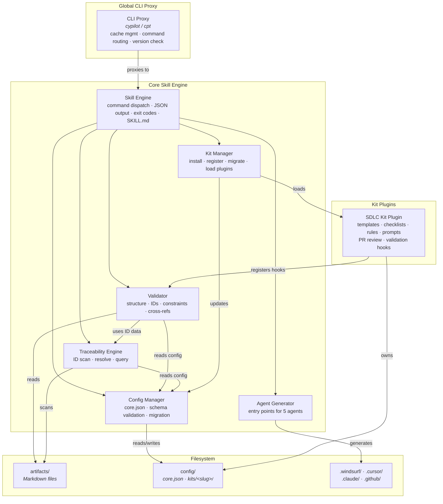
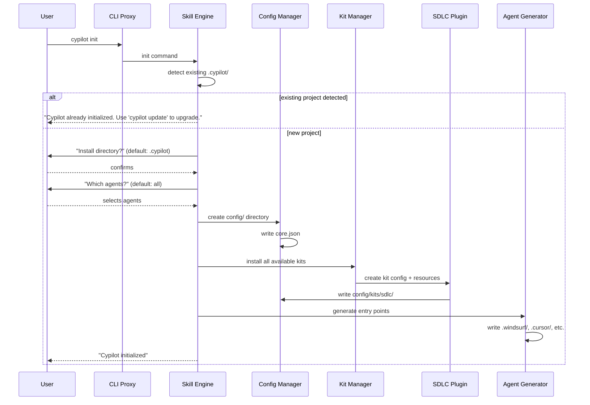

# Technical Design — Cyber Pilot (Cypilot)

## 1. Architecture Overview

### 1.1 Architectural Vision

Cypilot uses a layered architecture with a thin global CLI proxy at the top, a deterministic skill engine at the core, and an extensible kit plugin system for domain-specific functionality. The architecture maximizes determinism: all validation, scanning, and transformation is handled by Python scripts with JSON output; LLMs are reserved only for reasoning tasks within agent workflows.

The system separates concerns into five layers: Global CLI Proxy (installation, caching, version management), Core Skill Engine (command routing, deterministic execution), Kit Plugin System (domain-specific templates, rules, validation), Config Management (structured config directory, schema validation), and Agent Integration (multi-agent entry point generation). Each layer has clear boundaries and communicates through well-defined interfaces.

The plugin architecture allows kits to extend Cypilot without modifying core code. Each kit is a self-contained package with its own Python entry point, config files, resources (templates, checklists, rules, examples), versioning, and migration scripts. The core knows about kits through registration in `config/core.json` but does not interpret kit-specific semantics.

### 1.2 Architecture Drivers

#### Functional Drivers

##### Global CLI Installer

- [ ] `p1` - `cpt-cypilot-fr-core-installer`

**Design Response**: Thin proxy shell with local cache at `~/.cypilot/cache/`. On every invocation the proxy ensures a cached skill bundle exists, routes commands to the project-installed or cached skill, and performs non-blocking background version checks. The proxy contains zero skill logic.

##### Project Initialization

- [ ] `p1` - `cpt-cypilot-fr-core-init`

**Design Response**: Interactive bootstrapper that copies the skill from cache into the project, creates the `config/` directory structure, and generates agent entry points. Installed kits populate their own config directories with baseline autodetect rules.

##### Config Directory

- [ ] `p1` - `cpt-cypilot-fr-core-config`

**Design Response**: `config/core.json` holds system definitions, kit registrations, and ignore lists. `config/kits/<slug>/` directories hold per-kit config files. All config files use deterministic JSON serialization (sorted keys, consistent formatting). Cypilot core manages `core.json`; each kit's plugin manages its own config files.

##### Deterministic Skill Engine

- [ ] `p1` - `cpt-cypilot-fr-core-skill-engine`

**Design Response**: Python command router that dispatches to command handlers. All commands output JSON. Exit codes follow the convention: 0=PASS, 1=filesystem error, 2=FAIL. SKILL.md serves as the agent entry point with command reference and execution protocol.

##### Generic Workflows

- [ ] `p1` - `cpt-cypilot-fr-core-workflows`

**Design Response**: Two universal Markdown workflows (generate and analyze) with a common execution protocol. Workflows are loaded and interpreted by AI agents, not by the tool itself. The tool provides deterministic commands that workflows invoke.

##### Multi-Agent Integration

- [ ] `p1` - `cpt-cypilot-fr-core-agents`

**Design Response**: Agent Generator component produces entry points in each agent's native format: `.windsurf/workflows/`, `.cursor/rules/`, `.claude/commands/`, `.github/prompts/`. All entry points reference the core SKILL.md. The `agents` command fully overwrites entry points on each invocation.

##### Extensible Kit System

- [ ] `p1` - `cpt-cypilot-fr-core-kits`

**Design Response**: Kit Manager handles kit lifecycle: installation, registration in `core.json`, plugin loading, version tracking, and migration. Each kit provides a Python entry point that registers CLI subcommands, validation hooks, and generation hooks into the core skill at runtime.

##### ID and Traceability System

- [ ] `p1` - `cpt-cypilot-fr-core-traceability`

**Design Response**: Traceability Engine scans artifacts for `cpt-{system}-{kind}-{slug}` IDs, resolves cross-references, detects code tags (`@cpt-*`), and provides query commands (list-ids, where-defined, where-used, get-content). Validation enforces constraints from `constraints.json`.

##### Cypilot DSL (CDSL)

- [ ] `p1` - `cpt-cypilot-fr-core-cdsl`

**Design Response**: CDSL is a plain English specification language embedded in Markdown. The tool parses CDSL instruction markers (`- [ ] Inst-label:`) for implementation tracking. CDSL validation is part of the Validator component's template compliance checks.

##### SDLC Kit Plugin

- [ ] `p1` - `cpt-cypilot-fr-sdlc-plugin`

**Design Response**: The SDLC plugin is a generator and registrator — it deterministically generates all kit resources (templates, examples, rules, checklists, system prompts) from the kit's configuration and registers them into Cypilot's core workflows. The plugin provides CLI subcommands for managing autodetect rules, artifact patterns, and codebase definitions.

##### Artifact Validation

- [ ] `p1` - `cpt-cypilot-fr-sdlc-validation`

**Design Response**: Validator component performs single-pass scanning of artifact files: template structure compliance, ID format validation, priority marker presence, placeholder detection, and constraint enforcement. Cross-artifact validation checks covered_by references, checked consistency, and ID resolution across all registered artifacts.

##### PR Review Workflow

- [ ] `p1` - `cpt-cypilot-fr-sdlc-pr-review`

**Design Response**: PR review uses `gh` CLI to fetch PR data (diffs, metadata, comments), then delegates analysis to the AI agent with configurable prompts and checklists. The workflow is read-only (no local working tree modifications) and always re-fetches data on each invocation.

##### Version Detection and Updates

- [ ] `p2` - `cpt-cypilot-fr-core-version`

**Design Response**: The `update` command copies the cached skill into the project, migrates `config/core.json`, invokes each kit's migration script, and regenerates agent entry points. Config migration preserves all user settings. Version information is accessible via `--version`.

##### CLI Configuration Interface

- [ ] `p2` - `cpt-cypilot-fr-core-cli-config`

**Design Response**: Core CLI commands manage `core.json` (system definitions, ignore lists, kit registrations). Kit-specific config changes are delegated to each kit's plugin CLI subcommands. All config changes are validated against schemas before application. Dry-run mode is supported.

##### VS Code Plugin

- [ ] `p2` - `cpt-cypilot-fr-core-vscode-plugin`

**Design Response**: VS Code extension delegates all validation to the installed Cypilot skill (`cypilot validate`). The plugin reads config from the project's install directory, provides ID syntax highlighting, go-to-definition, real-time validation, autocompletion, hover info, CodeLens, traceability tree view, and quick fixes.

##### Artifact Pipeline

- [ ] `p1` - `cpt-cypilot-fr-sdlc-pipeline`

**Design Response**: The SDLC kit defines an artifact-first pipeline: PRD → DESIGN → ADR → DECOMPOSITION → FEATURE → CODE. Each artifact kind has a template, checklist, rules, and example — all generated by the SDLC plugin. Artifacts are usable independently (no forced sequence). The generate and analyze workflows handle both greenfield and brownfield entry points.

##### Cross-Artifact Validation

- [ ] `p1` - `cpt-cypilot-fr-sdlc-cross-artifact`

**Design Response**: The Validator component performs cross-artifact checks by loading all registered artifacts for a system and comparing ID definitions against references. Checks include: covered_by reference completeness per constraints.json rules, checked-ref-implies-checked-def consistency, and ID resolution across artifact boundaries. Cross-artifact validation runs as part of `cypilot validate` (no separate command).

##### PR Status Workflow

- [ ] `p1` - `cpt-cypilot-fr-sdlc-pr-status`

**Design Response**: PR status reuses the same `gh` CLI integration as PR review. The workflow fetches comments, CI status, and merge conflict state, then classifies unreplied comments by severity. Output is a structured JSON report. Shares the SDLC plugin's PR configuration (prompts, exclude lists).

##### Code Generation from Design

- [ ] `p2` - `cpt-cypilot-fr-sdlc-code-gen`

**Design Response**: Code generation is an agent-driven workflow (not a deterministic command). The generate workflow loads FEATURE artifacts, reads adapter-defined domain model and API contract paths, and instructs the agent to produce code with `@cpt-*` traceability tags. The tool validates tags after generation via the Traceability Engine.

##### Brownfield Support

- [ ] `p2` - `cpt-cypilot-fr-sdlc-brownfield`

**Design Response**: Brownfield entry uses `cypilot init` with existing code detection. The SDLC plugin's autodetect rules scan for existing documentation and code structure. The generate workflow supports reverse-engineering mode: agents analyze existing code and produce artifacts (PRD, DESIGN) that describe the current state. Incremental adoption is supported — start with config, add artifacts gradually.

##### Feature Lifecycle Management

- [ ] `p2` - `cpt-cypilot-fr-sdlc-lifecycle`

**Design Response**: Feature status (NOT_STARTED → IN_DESIGN → DESIGNED → READY → IN_PROGRESS → DONE) is tracked via checkbox state on FEATURE artifact ID definitions. The Validator enforces status transition rules and dependency blocking. Status queries use the Traceability Engine's ID scanning.

##### PR Review Configuration

- [ ] `p2` - `cpt-cypilot-fr-sdlc-pr-config`

**Design Response**: PR review configuration is stored in `config/kits/sdlc/` and managed by the SDLC plugin's CLI subcommands. Configuration includes prompt selection, checklist mapping, domain-specific review criteria, template variables, and PR exclude lists. Config changes are validated against the kit's schema before writing.

##### Quickstart Guides

- [ ] `p2` - `cpt-cypilot-fr-sdlc-guides`

**Design Response**: Quickstart guides are SDLC kit resources generated alongside templates and examples. Guides use progressive disclosure: human-facing overview docs with copy-paste prompts, and AI-facing navigation rules embedded in SKILL.md and agent entry points.

##### Utility Commands

- [ ] `p2` - `cpt-cypilot-fr-core-template-qa`
- [ ] `p2` - `cpt-cypilot-fr-core-doctor`
- [ ] `p3` - `cpt-cypilot-fr-core-hooks`
- [ ] `p3` - `cpt-cypilot-fr-core-completions`

**Design Response**: Utility commands are implemented as standalone handlers in the Skill Engine with no architectural impact beyond the standard command routing pattern. `self-check` validates examples against templates. `doctor` checks environment health (Python version, git, gh, agents, config integrity). `hook install/uninstall` manages git pre-commit hooks for lightweight validation. `completions install` generates shell completion scripts for bash/zsh/fish.

#### NFR Allocation

| NFR ID | NFR Summary | Allocated To | Design Response | Verification Approach |
|--------|-------------|--------------|-----------------|----------------------|
| `cpt-cypilot-nfr-validation-performance` | Single artifact validation ≤ 3s | `cpt-cypilot-component-validator` | Single-pass scanning, no external calls, in-memory processing, no LLM dependency | Benchmark test with largest project artifact |
| `cpt-cypilot-nfr-security-integrity` | No untrusted code execution, deterministic results, no secrets in config | `cpt-cypilot-component-config-manager`, `cpt-cypilot-component-validator` | Validator reads files as text only — no eval/exec. Config Manager rejects files containing known secret patterns. All commands are pure functions of input state | Determinism test: same repo state → same validation output |
| `cpt-cypilot-nfr-reliability-recoverability` | Actionable failure guidance, no settings loss on migration | `cpt-cypilot-component-config-manager`, `cpt-cypilot-component-skill-engine` | Config migration creates backup before applying changes. All error messages include file path, line number, and remediation steps | Migration test: upgrade config across 3 versions, verify no settings lost |
| `cpt-cypilot-nfr-adoption-usability` | ≤ 5 decisions in init, ≤ 3 clarifying questions per workflow | `cpt-cypilot-component-cli-proxy`, `cpt-cypilot-component-skill-engine` | Init uses sensible defaults (all agents, all kits). CLI provides `--help` with usage examples for every command | Count decisions in init flow; count agent questions per workflow |

### 1.3 Architecture Layers

The architecture is organized into five layers stacked top-to-bottom, where each layer depends only on the layer directly below it.

At the top sits the **AI Agent layer** — external coding assistants (Windsurf, Cursor, Claude Code, GitHub Copilot, OpenAI Codex) that read SKILL.md as their entry point and invoke Cypilot commands. Immediately below is the **Agent Entry Points layer**: generated files in agent-native directories (`.windsurf/`, `.cursor/`, `.claude/`, `.github/`) that contain workflow proxies and skill shims translating agent-specific formats into Cypilot CLI calls.

The **Global CLI Proxy layer** (`cypilot` / `cpt`, installed via pipx) is a thin stateless shell. It resolves the target skill — either from the project's local install directory or from the global cache (`~/.cypilot/cache/`) — and forwards the invocation. The proxy contains zero skill logic.

Below the proxy is the **Core Skill Engine layer** — the heart of the system. It owns the command router, JSON output serialization, SKILL.md, workflows, and the execution protocol. Three core components live here: the **Validator** (deterministic structural and cross-artifact checks), the **Traceability Engine** (ID scanning, resolution, and coverage analysis), and the **Config Manager** (schema-validated JSON config read/write with migration support).

At the bottom is the **Kit Plugin layer**. The **Kit Manager** handles kit installation, registration, and migration. Each kit is a self-contained plugin — the **SDLC Kit Plugin** being the primary one, providing templates, checklists, rules, examples, prompts, PR review/status workflows, and validation hooks. Kits register their resources and CLI subcommands into the core engine at load time.

- [ ] `p3` - **ID**: `cpt-cypilot-tech-python-stdlib`

| Layer | Responsibility | Technology |
|-------|---------------|------------|
| Global CLI Proxy | Installation entry point, cache management, version checks, command routing | Python (pipx-installable package) |
| Core Skill Engine | Command dispatch, JSON output, deterministic execution, workflow loading | Python 3.10+ stdlib |
| Kit Plugin System | Domain-specific resources, validation hooks, CLI subcommands, config ownership | Python plugins with entry points |
| Config Management | Config directory operations, schema validation, deterministic serialization | JSON, Python stdlib |
| Agent Integration | Entry point generation in native agent formats | Python, Markdown templates |

## 2. Principles & Constraints

### 2.1 Design Principles

#### Determinism First

- [ ] `p1` - **ID**: `cpt-cypilot-principle-determinism-first`

Everything that can be validated, checked, or enforced without an LLM MUST be handled by deterministic scripts. The LLM is reserved only for tasks requiring reasoning, creativity, or natural language understanding. This ensures reproducible results: same input → same output, regardless of which AI agent runs the command.

#### Kit-Centric

- [ ] `p1` - **ID**: `cpt-cypilot-principle-kit-centric`

All domain-specific value is delivered by extensible kits. Kits bring templates, checklists, rules, examples, validation hooks, CLI commands, and prompts. Core provides infrastructure (ID system, workflows, config, agent integration); kits provide the content and semantics. This separation ensures that new domains can be supported without modifying core code.

#### Traceability by Design

- [ ] `p1` - **ID**: `cpt-cypilot-principle-traceability-by-design`

All design elements use structured `cpt-*` IDs following the format `cpt-{system}-{kind}-{slug}`. Code tags (`@cpt-*`) link implementation to design. Cross-references between artifacts are validated deterministically. The ID system is the backbone of Cypilot's value proposition — it enables automated verification that code implements what was designed.

#### Plugin Extensibility

- [ ] `p1` - **ID**: `cpt-cypilot-principle-plugin-extensibility`

Kits are self-contained plugins that own their resources, config files, versioning, and migration scripts. Core does not interpret kit-specific semantics — it only knows that a kit is registered and where its config lives. User customizations (overrides of templates, checklists, rules) are preserved across kit updates through the plugin's migration mechanism.

#### Machine-Readable Output

- [ ] `p2` - **ID**: `cpt-cypilot-principle-machine-readable`

All CLI commands output JSON. Config files use deterministic serialization (sorted keys, consistent formatting). Validation results include file paths and line numbers. This enables programmatic consumption by CI pipelines, IDE plugins, and agent workflows without parsing human-readable text.

#### Tool-Managed Config

- [ ] `p2` - **ID**: `cpt-cypilot-principle-tool-managed-config`

Config files are edited exclusively by the tool, never manually. All changes go through CLI commands that validate against schemas before writing. This prevents configuration drift, ensures schema compliance, and enables reliable migration between versions.

#### Skill-Documented

- [ ] `p2` - **ID**: `cpt-cypilot-principle-skill-documented`

All tool capabilities MUST be fully documented in the agent-facing SKILL.md. SKILL.md is the single entry point for AI agents — it enumerates all commands, workflows, and integration points so agents can discover and use the tool's full functionality without external documentation.

#### DRY (Don't Repeat Yourself)

- [ ] `p1` - **ID**: `cpt-cypilot-principle-dry`

Every piece of knowledge — a template, a rule, a checklist criterion, a config schema — MUST have exactly one authoritative source. Kits generate resources from a single definition; agent entry points are generated from one template per agent; validation rules live in constraints.json, not duplicated across code. If something needs to change, it changes in one place.

#### Occam's Razor

- [ ] `p1` - **ID**: `cpt-cypilot-principle-occams-razor`

The simplest solution that satisfies the requirements is the correct one. No abstraction layers, extension points, or generalization beyond what is needed today. Prefer flat structures over nested, single-pass algorithms over multi-phase, plain functions over class hierarchies. Complexity must be justified by a concrete requirement, not by speculative future needs.

#### CI & Automation First, LLM Last Resort

- [ ] `p1` - **ID**: `cpt-cypilot-principle-ci-automation-first`

Every check, validation, and enforcement MUST be implementable as a deterministic CI step. LLM-based analysis is used only when deterministic methods are provably insufficient (e.g., semantic quality review, natural language understanding). If a task can be expressed as a regex, a schema check, or a graph traversal — it MUST NOT require an LLM. This ensures that quality gates are reproducible, fast, and free of hallucination risk.

#### Zero Harm, Only Benefits

- [ ] `p1` - **ID**: `cpt-cypilot-principle-zero-harm`

Adopting Cypilot MUST NOT impose costs on the development workflow. No mandatory file renames, no forced directory structures outside `.cypilot/` and `config/`, no blocking CI gates by default, no slowdowns to existing processes. Every feature is opt-in and additive. If a team removes Cypilot, their project continues to work exactly as before — only the `.cypilot/` directory and generated agent files are left behind.

#### No Manual Maintenance

- [ ] `p2` - **ID**: `cpt-cypilot-principle-no-manual-maintenance`

Nothing that can be generated MUST require manual upkeep. Agent entry points are regenerated on `update`. Kit resources are regenerated from plugin code. Config migrations run automatically. Shell completions are generated from command definitions. If a human must remember to update something after a version change, that is a bug in the tool.

### 2.2 Constraints

#### Python Standard Library Only

- [ ] `p1` - **ID**: `cpt-cypilot-constraint-python-stdlib`

Core skill engine uses Python 3.10+ standard library only. No third-party dependencies in core. This ensures the tool works in any Python 3.10+ environment without dependency conflicts. Kits may declare their own dependencies, managed separately.

#### Markdown as Contract

- [ ] `p1` - **ID**: `cpt-cypilot-constraint-markdown-contract`

Artifacts are Markdown files with structured `cpt-*` IDs. Markdown is the contract format between humans, agents, and the tool. Workflows, templates, checklists, and rules are all Markdown. This leverages the universal readability of Markdown while enabling deterministic parsing of structured elements.

#### Git Project Heuristics

- [ ] `p2` - **ID**: `cpt-cypilot-constraint-git-project-heuristics`

Git is the primary project detection mechanism (`.git` directory provides project root detection and version control integration). Non-Git projects are supported but without Git-based heuristics — the tool falls back to the current working directory as project root.

#### No Weakening of Rules

- [ ] `p1` - **ID**: `cpt-cypilot-constraint-no-weakening`

Validation rules cannot be bypassed or weakened in STRICT mode. The deterministic gate must pass before semantic review proceeds. This constraint ensures that the quality floor is maintained — agents cannot skip validation steps or downgrade severity of issues.

## 3. Technical Architecture

### 3.1 Domain Model

**Technology**: Python dataclasses, JSON

**Location**: In-memory models built from filesystem state (no persistent database)

**Machine-Readable Schemas**:
- **Config schema**: `config/core.json` structure defined by [core-config.schema.json](.cypilot/schemas/core-config.schema.json) (planned)
- **Kit constraints schema**: [kit-constraints.schema.json](.cypilot/schemas/kit-constraints.schema.json)
- **Artifact registry**: [artifacts.json](.cypilot-adapter/artifacts.json) — system, autodetect, and codebase definitions
- **ID format specification**: [identifiers.md](.cypilot/requirements/identifiers.md) — `cpt-{system}-{kind}-{slug}` grammar
- **Python types**: `skills/cypilot/scripts/cypilot/` — dataclass definitions for in-memory models

**Core Entities**:

| Entity | Description | Source |
|--------|-------------|--------|
| System | A named project or subsystem with slug, kit assignment, and autodetect rules | `config/core.json` → systems[] |
| Artifact | A Markdown file of a specific kind (PRD, DESIGN, ADR, etc.) belonging to a system | Filesystem, registered via autodetect |
| Kit | An installable plugin package with resources, config, versioning, and Python entry point | `config/core.json` → kits{}, `config/kits/<slug>/` |
| Identifier | A `cpt-*` ID with kind, slug, definition location (file + line), and references | Scanned from artifact Markdown |
| Config | Structured JSON in `config/` directory — core.json + per-kit configs | Filesystem |
| AgentEntryPoint | Generated file in an agent's native format (workflow proxy, skill shim, or rule file) | Generated into `.windsurf/`, `.cursor/`, etc. |
| Constraint | Kit-defined rules for ID kinds, headings, and cross-artifact references | `kits/<slug>/constraints.json` |
| Workflow | A Markdown file with frontmatter, phases, and validation criteria | `.cypilot/workflows/` |

**Relationships**:
- System → Kit: each system is assigned to exactly one kit (by slug)
- System → Artifact[]: a system contains zero or more artifacts, discovered via autodetect rules
- System → Codebase[]: a system tracks zero or more codebase directories
- Kit → Config: each kit owns config files in `config/kits/<slug>/`
- Kit → Resource[]: each kit generates templates, checklists, rules, examples per artifact kind
- Artifact → Identifier[]: each artifact contains zero or more ID definitions and references
- Identifier → Identifier: cross-references between definitions and references across artifacts
- Constraint → Identifier: constraints define which ID kinds are allowed/required per artifact kind

### 3.2 Component Model

#### CLI Proxy

- [ ] `p1` - **ID**: `cpt-cypilot-component-cli-proxy`

##### Why this component exists

Provides a stable global entry point (`cypilot`/`cpt`) that works both inside and outside projects. Manages the skill bundle cache so users don't need to manually download or update the tool.

##### Responsibility scope

- Maintain local skill bundle cache (`~/.cypilot/cache/`)
- Route commands to project-installed skill (if inside a project) or cached skill (if outside)
- Perform non-blocking background version checks
- Display version update notices when cached version is newer than project version

##### Responsibility boundaries

Does NOT contain any skill logic, workflow logic, or command implementations. Does NOT interpret command arguments — passes them through to the resolved skill. Does NOT modify project files.

##### Related components (by ID)

- `cpt-cypilot-component-skill-engine` — proxies all commands to this component

#### Skill Engine

- [ ] `p1` - **ID**: `cpt-cypilot-component-skill-engine`

##### Why this component exists

Central command dispatcher that provides a uniform interface for all Cypilot functionality. Ensures all commands follow the same conventions (JSON output, exit codes, deterministic behavior).

##### Responsibility scope

- Parse and route CLI commands to appropriate handlers
- Enforce JSON output format for all commands
- Manage exit code conventions (0=PASS, 1=error, 2=FAIL)
- Load and expose SKILL.md as the agent entry point
- Register kit plugin commands at runtime

##### Responsibility boundaries

Does NOT execute workflows (workflows are interpreted by AI agents). Does NOT contain domain-specific validation logic (delegated to kits). Does NOT manage config schema — delegates to Config Manager.

##### Related components (by ID)

- `cpt-cypilot-component-cli-proxy` — receives commands from proxy
- `cpt-cypilot-component-validator` — delegates validation commands
- `cpt-cypilot-component-traceability-engine` — delegates ID query commands
- `cpt-cypilot-component-config-manager` — delegates config commands
- `cpt-cypilot-component-kit-manager` — loads kit plugins at startup
- `cpt-cypilot-component-agent-generator` — delegates agent commands

#### Validator

- [ ] `p1` - **ID**: `cpt-cypilot-component-validator`

##### Why this component exists

Provides the deterministic quality gate that ensures artifacts meet structural requirements without relying on an LLM. This is the core of Cypilot's value — catching issues that agents miss or hallucinate.

##### Responsibility scope

- Template structure compliance checking (heading patterns, required sections)
- ID format validation (`cpt-{system}-{kind}-{slug}` pattern)
- Priority marker validation
- Placeholder detection (TODO, TBD, FIXME)
- Cross-reference validation (covered_by, checked consistency)
- Constraint enforcement from `constraints.json` (headings scoping, reference rules)
- Single-pass scanning for performance (≤ 3s per artifact)

##### Responsibility boundaries

Does NOT perform semantic validation (checklist review is done by AI agents). Does NOT modify artifacts — read-only analysis. Does NOT validate code files directly (code validation delegated to kit plugins).

##### Related components (by ID)

- `cpt-cypilot-component-skill-engine` — receives validation commands
- `cpt-cypilot-component-traceability-engine` — uses ID scanning results
- `cpt-cypilot-component-config-manager` — reads config for system/artifact resolution
- `cpt-cypilot-component-sdlc-plugin` — SDLC kit registers validation hooks

#### Traceability Engine

- [ ] `p1` - **ID**: `cpt-cypilot-component-traceability-engine`

##### Why this component exists

Implements the ID system that links design elements to code. Without this component, there is no automated way to verify that code implements what was designed.

##### Responsibility scope

- Scan artifacts for ID definitions (`**ID**: \`cpt-...\``) and references (backticked `cpt-...`)
- Scan code for traceability tags (`@cpt-*`)
- Resolve cross-references between definitions and references
- Provide query commands: `list-ids`, `list-id-kinds`, `where-defined`, `where-used`, `get-content`
- Support ID versioning (`-vN` suffix)

##### Responsibility boundaries

Does NOT define which ID kinds are valid — that comes from kit constraints. Does NOT enforce cross-artifact reference rules — that's the Validator's job (using data from this engine). Does NOT modify files.

##### Related components (by ID)

- `cpt-cypilot-component-validator` — provides ID scan data for validation
- `cpt-cypilot-component-skill-engine` — receives query commands
- `cpt-cypilot-component-config-manager` — reads config for system/artifact resolution

#### Config Manager

- [ ] `p1` - **ID**: `cpt-cypilot-component-config-manager`

##### Why this component exists

Ensures config integrity by centralizing all config file operations behind schema validation. Prevents configuration drift and enables reliable migration between versions.

##### Responsibility scope

- CRUD operations on `config/core.json` (system definitions, kit registrations, ignore lists)
- Schema validation before any write operation
- Deterministic JSON serialization (sorted keys, consistent formatting)
- Config migration between versions (with backup before migration)
- Provide CLI commands for config inspection (`config show`)

##### Responsibility boundaries

Does NOT manage kit-specific config files — delegates to kit plugins. Does NOT interpret kit config semantics. Does NOT handle kit migration — invokes kit migration scripts.

##### Related components (by ID)

- `cpt-cypilot-component-skill-engine` — receives config commands
- `cpt-cypilot-component-kit-manager` — coordinates kit config creation during installation
- `cpt-cypilot-component-validator` — provides config data for validation context

#### Kit Manager

- [ ] `p1` - **ID**: `cpt-cypilot-component-kit-manager`

##### Why this component exists

Manages the kit plugin lifecycle — installing, registering, updating, and migrating kits. Enables the extensible architecture where new domains can be added without modifying core.

##### Responsibility scope

- Kit installation: create directory structure, copy resources, create config files
- Kit registration: add kit entry to `config/core.json`
- Plugin loading: discover and load kit Python entry points at runtime
- CLI subcommand registration: register kit-provided commands into the skill engine
- Version tracking: store kit version in kit config
- Migration coordination: invoke kit migration scripts during `cypilot update`
- Kit structural validation (`validate-kits` command)

##### Responsibility boundaries

Does NOT own kit resources (templates, checklists, rules) — kits generate and manage their own. Does NOT interpret kit config semantics. Does NOT perform kit-specific validation.

##### Related components (by ID)

- `cpt-cypilot-component-skill-engine` — registers kit CLI subcommands
- `cpt-cypilot-component-config-manager` — updates core.json during kit registration
- `cpt-cypilot-component-sdlc-plugin` — primary kit that is loaded

#### Agent Generator

- [ ] `p2` - **ID**: `cpt-cypilot-component-agent-generator`

##### Why this component exists

Bridges the gap between Cypilot's unified skill system and the diverse file format requirements of different AI coding assistants. Without this component, users would need to manually create and maintain agent-specific files.

##### Responsibility scope

- Generate workflow entry points in each agent's native format
- Generate skill shims that reference the core SKILL.md
- Support 5 agents: Windsurf (`.windsurf/workflows/`), Cursor (`.cursor/rules/`), Claude (`.claude/commands/`), Copilot (`.github/prompts/`), OpenAI
- Full overwrite on each invocation (no merge with existing files)
- Support `--agent` flag for single-agent regeneration

##### Responsibility boundaries

Does NOT maintain agent-specific state. Does NOT modify SKILL.md or workflow files. Does NOT persist agent selection in config.

##### Related components (by ID)

- `cpt-cypilot-component-skill-engine` — receives `agents` command
- `cpt-cypilot-component-config-manager` — reads config for project context

#### SDLC Kit Plugin

- [ ] `p1` - **ID**: `cpt-cypilot-component-sdlc-plugin`

##### Why this component exists

Provides the artifact-first development methodology that is Cypilot's primary use case. Without this kit, Cypilot would be a generic ID system without domain-specific value.

##### Responsibility scope

- Resource generation: deterministically generate templates, examples, rules, checklists, system prompts for each artifact kind (PRD, DESIGN, ADR, DECOMPOSITION, FEATURE)
- Artifact type control: define structure, validation rules, and relationships for all SDLC artifact kinds
- Workflow integration: register validation hooks and generation hooks into core analyze/generate workflows
- PR review/status workflows: fetch PR data via `gh` CLI, analyze against configurable prompts
- User customization: manage prompt embedding in rules, checklist customization, template customization, rules customization
- Update compatibility: merge user overrides with updated defaults during migration, flag conflicts
- Config management: own and manage `config/kits/sdlc/` with autodetect rules, artifact definitions, constraints

##### Responsibility boundaries

Does NOT own the ID system — uses core traceability engine. Does NOT own workflows — registers hooks into core workflows. Does NOT manage `core.json` — only its own config directory.

##### Related components (by ID)

- `cpt-cypilot-component-kit-manager` — loaded by kit manager at startup
- `cpt-cypilot-component-validator` — registers validation hooks
- `cpt-cypilot-component-skill-engine` — registers CLI subcommands (`sdlc` namespace)
- `cpt-cypilot-component-config-manager` — reads core config for system/artifact context

### 3.3 API Contracts

- [ ] `p1` - **ID**: `cpt-cypilot-interface-cli-json`

**Type**: CLI (command-line interface)
**Stability**: stable
**Format**: All commands output JSON to stdout

**Core Commands**:

| Command | Description | Exit Code |
|---------|-------------|-----------|
| `validate --artifact <path>` | Validate single artifact | 0=PASS, 2=FAIL |
| `validate` | Validate all registered artifacts | 0=PASS, 2=FAIL |
| `list-ids [--kind K] [--pattern P]` | List IDs matching criteria | 0 |
| `where-defined <id>` | Find where an ID is defined | 0=found, 2=not found |
| `where-used <id>` | Find where an ID is referenced | 0 |
| `get-content <id>` | Get content block for an ID | 0=found, 2=not found |
| `adapter-info` | Show adapter status and registry | 0 |
| `agents [--agent A]` | Generate agent entry points | 0 |
| `doctor` | Environment health check | 0=healthy, 2=issues |
| `config show` | Display current core config | 0 |
| `config system add/remove` | Manage system definitions | 0 |
| `init` | Initialize project | 0 |
| `update` | Update project skill to cached version | 0 |
| `hook install/uninstall` | Manage pre-commit hooks | 0 |
| `self-check` | Validate examples against templates | 0=PASS, 2=FAIL |

**Kit Commands (SDLC)**:

| Command | Description | Exit Code |
|---------|-------------|-----------|
| `sdlc autodetect show --system S` | Show autodetect rules for a system | 0 |
| `sdlc autodetect add-artifact` | Add artifact autodetect rule | 0 |
| `sdlc autodetect add-codebase` | Add codebase definition | 0 |
| `sdlc pr-review <number>` | Review a PR | 0 |
| `sdlc pr-status <number>` | Check PR status | 0 |

- [ ] `p2` - **ID**: `cpt-cypilot-interface-github-gh-cli`

**Direction**: required from client
**Protocol/Format**: GitHub REST/GraphQL API accessed through `gh` CLI v2.0+
**Used by**: SDLC Kit Plugin (PR review/status workflows)

### 3.4 Internal Dependencies

No internal module dependencies beyond the component relationships documented in Section 3.2. All components are part of a single Python package and communicate through direct function calls within the same process.

**Dependency Rules**:
- Components access each other through well-defined interfaces (not internal implementation details)
- Validator and Traceability Engine share scan results through a common data model (ID definitions, references)
- Kit plugins register hooks at startup — core components invoke hooks through a registry, not direct imports
- No circular dependencies: core components do not depend on kit plugins; plugins depend on core interfaces

### 3.5 External Dependencies

#### GitHub API (via `gh` CLI)

| Dependency | Interface Used | Purpose |
|------------|---------------|---------|
| `gh` CLI v2.0+ | CLI subprocess invocation | Fetch PR diffs, metadata, comments, and status for SDLC kit PR review/status workflows |

**Dependency Rules**:
- `gh` CLI is optional — only required for PR review/status workflows
- `cypilot doctor` checks `gh` availability and authentication status
- PR workflows fail gracefully with actionable error message if `gh` is not available

#### Python Runtime

| Dependency | Interface Used | Purpose |
|------------|---------------|---------|
| Python 3.10+ | Runtime environment | Execute all Cypilot skill scripts and kit plugins |

**Dependency Rules**:
- Core uses stdlib only — no pip dependencies
- `cypilot doctor` checks Python version compatibility

#### pipx (recommended)

| Dependency | Interface Used | Purpose |
|------------|---------------|---------|
| pipx | Package installer | Global CLI proxy installation in isolated environment |

**Dependency Rules**:
- pipx is recommended but not required — manual installation is possible
- `cypilot doctor` checks pipx availability

### 3.6 Interactions & Sequences

#### Project Initialization

**ID**: `cpt-cypilot-seq-init`

**Use cases**: `cpt-cypilot-usecase-init`

**Actors**: `cpt-cypilot-actor-user`, `cpt-cypilot-actor-cypilot-cli`

**Description**: User initializes Cypilot in a project. The skill engine orchestrates directory creation, config population, kit installation, and agent entry point generation.

#### Artifact Validation

**ID**: `cpt-cypilot-seq-validate`

**Use cases**: `cpt-cypilot-usecase-validate`

**Actors**: `cpt-cypilot-actor-user`, `cpt-cypilot-actor-ci-pipeline`

**Description**: Single artifact validation flow. The validator performs a single-pass scan, using the traceability engine for ID resolution, and returns a structured JSON report with PASS/FAIL status.

#### Agent Workflow Execution (Generate)

**ID**: `cpt-cypilot-seq-generate-workflow`

**Use cases**: `cpt-cypilot-usecase-create-artifact`

**Actors**: `cpt-cypilot-actor-user`, `cpt-cypilot-actor-ai-agent`

**Description**: Artifact generation is orchestrated by the AI agent, not the tool. The agent reads workflows and rules as instructions, collects information from the user, generates content, writes files, and invokes deterministic validation.

#### PR Review

**ID**: `cpt-cypilot-seq-pr-review`

**Use cases**: `cpt-cypilot-usecase-pr-review`

**Actors**: `cpt-cypilot-actor-user`, `cpt-cypilot-actor-ai-agent`

**Description**: PR review is driven by the AI agent using `gh` CLI for data fetching. The tool provides configurable prompts and checklists; the agent performs the analysis and writes a structured report.

#### Version Update

**ID**: `cpt-cypilot-seq-update`

**Use cases**: `cpt-cypilot-usecase-update`

**Actors**: `cpt-cypilot-actor-user`, `cpt-cypilot-actor-cypilot-cli`

**Description**: Update copies the cached skill into the project, migrates config files (with backup), invokes kit migration scripts, and regenerates agent entry points for compatibility.

#### ID Resolution Query

**ID**: `cpt-cypilot-seq-traceability-query`

**Use cases**: `cpt-cypilot-usecase-validate`

**Actors**: `cpt-cypilot-actor-user`, `cpt-cypilot-actor-ai-agent`

**Description**: ID resolution query scans all registered artifacts to find where an ID is defined. Used by agents for navigation and by the validator for cross-reference checking.

### 3.7 Database schemas & tables

Not applicable — Cypilot does not use a database. All persistent state is stored in the filesystem:

- **`config/core.json`** — core config (system definitions, kit registrations, ignore lists)
- **`config/kits/<slug>/*.json`** — per-kit config files (autodetect rules, constraints, settings)
- **`~/.cypilot/cache/`** — global skill bundle cache
- **Markdown artifacts** — source of truth for design (PRD.md, DESIGN.md, etc.)
- **`.cypilot-adapter/artifacts.json`** — artifact registry (systems, artifacts, codebases)

## 4. Additional context

### Performance Considerations

The validator uses single-pass scanning to meet the ≤ 3 second requirement. Artifacts are read once into memory, and all checks (template structure, ID format, constraints, cross-references) are performed in a single traversal. No external calls (network, database, LLM) are made during validation.

### Extensibility Model

The kit plugin system is designed for extension at three levels:

1. **Kit-level**: New kits can be created for entirely new domains (e.g., API design, infrastructure-as-code). Each kit is a self-contained package.
2. **Artifact-level**: Within a kit, new artifact kinds can be added via config. The SDLC kit supports adding custom artifact types through its plugin CLI.
3. **Resource-level**: Within an artifact kind, users can override templates, extend checklists, modify rules, and embed custom prompts. Overrides are preserved across updates.

### Migration Strategy

Config migration follows a forward-only strategy:
1. Each version of `core.json` has a schema version field
2. Migration scripts transform config from version N to N+1
3. Kit plugins provide their own migration scripts for `config/kits/<slug>/`
4. Before any migration, a backup is created
5. If migration fails, the backup is restored and the user is notified

### Testing Approach

Component-level tests use fixture artifacts (synthetic Markdown files and JSON configs in `tests/fixtures/`). Mock boundaries:

- **Validator tests**: use fixture artifacts with known structural issues; no filesystem mocking needed (real temp files)
- **Traceability Engine tests**: use fixture artifacts with known ID patterns; verify scan results against expected definitions/references
- **Config Manager tests**: use temporary config directories; verify schema validation, serialization determinism, and migration correctness
- **CLI integration tests**: invoke the skill engine as a subprocess with fixture projects; verify JSON output and exit codes
- **Kit plugin tests**: use fixture kit directories; verify resource generation, CLI subcommand registration, and migration scripts
- **PR review tests**: mock `gh` CLI subprocess calls; verify prompt loading and report structure

Test data strategy: all test fixtures are self-contained in `tests/` — no dependency on the live `architecture/` or `config/` directories. Tests verify determinism by running the same input twice and asserting identical output.

### Non-Applicable Design Domains

The following design domains are not applicable to Cypilot and are explicitly excluded:

- **Security Architecture** (SEC): Cypilot is a local CLI tool with no authentication, authorization, or data protection requirements. It does not handle user credentials, PII, or network security. The only security consideration (no secrets in config, no untrusted code execution) is addressed in the NFR allocation.
- **Performance Architecture** (PERF): Cypilot processes single repositories locally with single-pass in-memory scanning. There is no caching strategy, database access optimization, or scalability architecture needed. The ≤ 3s validation target is met by design (single-pass, stdlib-only, no external calls).
- **Reliability Architecture** (REL): Cypilot runs as a local CLI tool, not a service. There are no fault tolerance, redundancy, or disaster recovery requirements. Config migration with backup addresses the only recoverability concern.
- **Data Architecture** (DATA): No database. All state is in the filesystem (Markdown + JSON). No data partitioning, replication, sharding, or archival needed.
- **Integration Architecture** (INT): The only external integration is `gh` CLI for PR review, which is a simple subprocess call with graceful failure handling. No integration middleware, event architecture, or API gateway needed.
- **Operations Architecture** (OPS): Installed locally via pipx. No deployment topology, container orchestration, observability infrastructure, or monitoring needed.
- **Compliance Architecture** (COMPL): No regulated data, no compliance certifications, no privacy architecture needed.
- **Usability Architecture** (UX): CLI tool with no frontend. No state management, responsive design, or progressive enhancement needed.

## 5. Traceability

- **PRD**: [PRD.md](./PRD.md)
- **ADRs**: [ADR/](./ADR/) (none created yet)
- **Features**: [features/](./features/) (none created yet)
