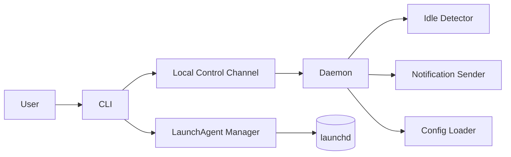
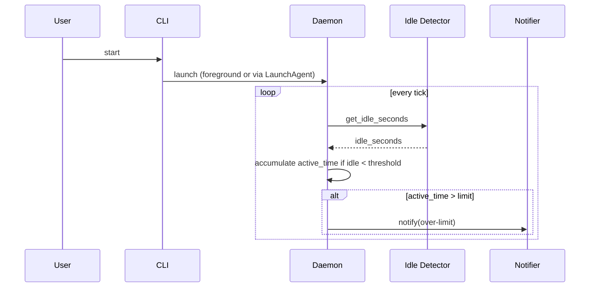
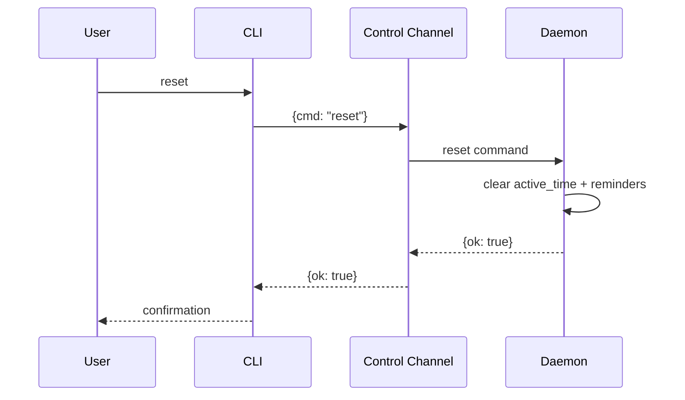

# Technical Design — Overwork Alert

<!-- toc -->

- [1. Architecture Overview](#1-architecture-overview)
  - [1.1 Architectural Vision](#11-architectural-vision)
  - [1.2 Architecture Drivers](#12-architecture-drivers)
    - [Functional Drivers](#functional-drivers)
      - [Track active work time (idle-aware)](#track-active-work-time-idle-aware)
      - [Configure limit and idle threshold](#configure-limit-and-idle-threshold)
      - [Notify when limit is exceeded and repeat reminders](#notify-when-limit-is-exceeded-and-repeat-reminders)
      - [Manual reset (no automatic reset)](#manual-reset-no-automatic-reset)
      - [Run continuously in background and support autostart](#run-continuously-in-background-and-support-autostart)
      - [Provide CLI controls (status/pause/resume/reset)](#provide-cli-controls-statuspauseresumereset)
    - [NFR Allocation](#nfr-allocation)
      - [Privacy & Data Handling](#privacy-data-handling)
      - [Reliability](#reliability)
      - [Performance & Resource Usage](#performance-resource-usage)
    - [Architecture Decisions Records](#architecture-decisions-records)
      - [Use CLI daemon + LaunchAgent (no menubar UI)](#use-cli-daemon-launchagent-no-menubar-ui)
  - [1.3 Architecture Layers](#13-architecture-layers)
- [2. Principles & Constraints](#2-principles-constraints)
  - [2.1 Design Principles](#21-design-principles)
    - [Local-only and minimal state](#local-only-and-minimal-state)
    - [Predictable, explicit user control](#predictable-explicit-user-control)
    - [Low overhead background behavior](#low-overhead-background-behavior)
  - [2.2 Constraints](#22-constraints)
    - [macOS-only, no custom UI surface](#macos-only-no-custom-ui-surface)
    - [No automatic reset and no persistence of accumulated time](#no-automatic-reset-and-no-persistence-of-accumulated-time)
- [3. Technical Architecture](#3-technical-architecture)
  - [3.1 Domain Model](#31-domain-model)
  - [3.2 Component Model](#32-component-model)
    - [CLI](#cli)
      - [Why this component exists](#why-this-component-exists)
      - [Responsibility scope](#responsibility-scope)
      - [Responsibility boundaries](#responsibility-boundaries)
      - [Related components (by ID)](#related-components-by-id)
    - [Daemon / Tracker Loop](#daemon-tracker-loop)
    - [Local Control Channel](#local-control-channel)
    - [Idle Detector](#idle-detector)
    - [Notification Sender](#notification-sender)
    - [Config Loader](#config-loader)
    - [LaunchAgent Manager](#launchagent-manager)
  - [3.3 API Contracts](#33-api-contracts)
  - [3.4 Internal Dependencies](#34-internal-dependencies)
  - [3.5 External Dependencies](#35-external-dependencies)
  - [3.6 Interactions & Sequences](#36-interactions-sequences)
    - [Run tracker and receive an overwork alert](#run-tracker-and-receive-an-overwork-alert)
    - [Reset a session via CLI](#reset-a-session-via-cli)
  - [3.7 Database schemas & tables](#37-database-schemas-tables)
    - [Table tracker_state (conceptual; in-memory only)](#table-trackerstate-conceptual-in-memory-only)
    - [Table config (conceptual; file-backed)](#table-config-conceptual-file-backed)
  - [3.8 Topology](#38-topology)
  - [3.9 Tech stack](#39-tech-stack)
- [4. Additional Context](#4-additional-context)
- [5. Traceability](#5-traceability)

<!-- /toc -->

## 1. Architecture Overview

### 1.1 Architectural Vision

Overwork Alert is a single-user, local-only macOS tool implemented as a background daemon with a companion CLI. The daemon continuously estimates “active work time” using an idle-aware clock and emits macOS notifications when a configurable limit is exceeded.

The system boundary is the user’s macOS session: the tool does not depend on remote services and does not persist accumulated work time across restarts. Architecture choices prioritize low complexity, low overhead, and predictable behavior (no automatic midnight reset; only explicit manual reset).

### 1.2 Architecture Drivers

#### Functional Drivers

##### Track active work time (idle-aware)

- [x] `p1` - `cpt-ex-ovwa-fr-track-active-time`

**Solution**: A daemon runs a periodic loop. Each tick reads current idle time from macOS (idle detector) and increments `active_time` only when idle is below the configured threshold and tracking is not paused.

##### Configure limit and idle threshold

- [x] `p1` - `cpt-ex-ovwa-fr-configurable-limit`

**Solution**: Configuration is read from a local config file with safe defaults. The daemon loads configuration on startup and can be restarted (or later extended to support reload) to apply changes.

##### Notify when limit is exceeded and repeat reminders

- [x] `p1` - `cpt-ex-ovwa-fr-notify-on-limit`

**Solution**: The daemon transitions into an “over limit” state when `active_time > limit`. A notifier component sends a macOS notification immediately, then repeats at the configured interval while the user remains active and the session is still over limit.

##### Manual reset (no automatic reset)

- [x] `p2` - `cpt-ex-ovwa-fr-manual-reset`

**Solution**: The daemon exposes a control channel. The CLI sends a `reset` command, which causes the daemon to zero the in-memory accumulated `active_time` and clear over-limit reminder state.

##### Run continuously in background and support autostart

- [x] `p2` - `cpt-ex-ovwa-fr-autostart`

**Solution**: Provide LaunchAgent installation/uninstallation that starts the daemon at login. The daemon is designed as a long-running process with safe defaults and defensive error handling.

##### Provide CLI controls (status/pause/resume/reset)

- [x] `p2` - `cpt-ex-ovwa-fr-cli-controls`

**Solution**: A CLI provides user-facing commands and communicates with the daemon via a local-only control interface to query status and issue commands.

#### NFR Allocation

##### Privacy & Data Handling

- [x] `p1` - `cpt-ex-ovwa-nfr-privacy-local-only`

**Solution**: No network I/O is performed. Only minimal local configuration and runtime control artifacts (e.g., a local socket path) are used.

##### Reliability

- [x] `p2` - `cpt-ex-ovwa-nfr-reliability`

**Solution**: Notification failures are treated as non-fatal; tracking continues and status remains queryable via CLI. The daemon loop isolates OS integration errors so a single failed tick cannot crash the process.

##### Performance & Resource Usage

- [x] `p2` - `cpt-ex-ovwa-nfr-low-overhead`

**Solution**: Use low-frequency polling (seconds-level) for idle detection and accumulation. Avoid heavyweight dependencies and avoid high-frequency sampling.

#### Architecture Decisions Records

##### Use CLI daemon + LaunchAgent (no menubar UI)

- `cpt-ex-ovwa-adr-cli-daemon-launchagent-no-menubar`

The implementation is split into a long-running daemon and a short-lived CLI. This keeps v1 small and repository-friendly, enables autostart via LaunchAgent, and avoids UI lifecycle complexity.

### 1.3 Architecture Layers

| Layer | Responsibility | Technology |
|-------|---------------|------------|
| CLI / Control | User commands (status/pause/resume/reset), install/uninstall autostart | Python CLI (argparse), local IPC |
| Tracking Core | Idle-aware accumulation, over-limit state, reminder scheduling | Python daemon loop |
| OS Integration | Idle time signal, notification delivery, login autostart | `ioreg` idle time query, `osascript` notification, launchd LaunchAgent |

## 2. Principles & Constraints

### 2.1 Design Principles

#### Local-only and minimal state

- [x] `p1` - **ID**: `cpt-ex-ovwa-principle-local-only-minimal-state`

The tool must not require network services and should store only what is necessary to operate. Accumulated active time is kept in-memory only and resets on daemon restart.

#### Predictable, explicit user control

- [x] `p1` - **ID**: `cpt-ex-ovwa-principle-explicit-control`

The system should not make time-based policy decisions like automatic midnight resets. Resetting and pausing are explicit user actions via the CLI.

#### Low overhead background behavior

- [x] `p2` - **ID**: `cpt-ex-ovwa-principle-low-overhead`

The daemon must be suitable for always-on use: avoid tight loops, prefer coarse polling intervals, and keep OS interactions lightweight.

### 2.2 Constraints

#### macOS-only, no custom UI surface

- [x] `p1` - **ID**: `cpt-ex-ovwa-constraint-macos-cli-only`

The v1 tool targets macOS only and is delivered as CLI + daemon; there is no menubar application or custom GUI.

#### No automatic reset and no persistence of accumulated time

- [x] `p1` - **ID**: `cpt-ex-ovwa-constraint-no-auto-reset-no-persist`

Accumulated active work time is session-scoped: it resets when the daemon restarts and only resets during runtime when the user explicitly invokes manual reset.

## 3. Technical Architecture

### 3.1 Domain Model

Core types and invariants:

- `Config`: `limit_seconds`, `idle_threshold_seconds`, `repeat_interval_seconds`, and integration settings (e.g., socket path).
- `TrackerState`: `status` (running/paused), `active_time_seconds`, `over_limit_since`, `last_reminder_at`, `last_tick_at`.
- `IdleSample`: current `idle_seconds` observed from macOS.
- `ControlCommand`: one of `status`, `pause`, `resume`, `reset`, `stop`.

Invariants:

- `active_time_seconds` increases only while `status=running` and `idle_seconds < idle_threshold_seconds`.
- When `active_time_seconds > limit_seconds`, the system is considered “over limit” until a reset occurs.
- `reset` sets `active_time_seconds` to zero and clears over-limit reminder scheduling state.

### 3.2 Component Model

#### CLI

- [x] `p1` - **ID**: `cpt-ex-ovwa-component-cli`

##### Why this component exists

The CLI is the sole user-facing entry point. It translates human commands into control messages and presents daemon state as readable output.

##### Responsibility scope

- Parse user commands (`status`, `pause`, `resume`, `reset`, `start`, `stop`, `install-autostart`, `uninstall-autostart`)
- Display formatted status output
- Send control commands to the daemon via the control channel
- Manage LaunchAgent installation/uninstallation

##### Responsibility boundaries

- No tracking logic; no accumulation; no background loop
- Does not read idle time or send notifications

##### Related components (by ID)

- `cpt-ex-ovwa-component-control-channel`
- `cpt-ex-ovwa-component-launchagent-manager`

#### Daemon / Tracker Loop

- [x] `p1` - **ID**: `cpt-ex-ovwa-component-daemon`

- **Responsibilities**: Maintain in-memory `TrackerState`; run periodic tick loop; decide when to notify; respond to control commands.
- **Boundaries**: Does not persist accumulated time; does not render UI; avoids network I/O.
- **Dependencies**: Idle Detector; Notification Sender; Config Loader; Control Channel.
- **Key interfaces**: `tick(state, config, idle_sample) -> state`; `handle_command(cmd) -> response`.

#### Local Control Channel

- [x] `p2` - **ID**: `cpt-ex-ovwa-component-control-channel`

- **Responsibilities**: Provide local-only communication between CLI and daemon.
- **Boundaries**: Not remotely accessible; does not require privileged ports.
- **Dependencies**: OS sockets.
- **Key interfaces**: Request/response messages for `status`, `pause`, `resume`, `reset`, and `stop`.

#### Idle Detector

- [x] `p2` - **ID**: `cpt-ex-ovwa-component-idle-detector`

- **Responsibilities**: Query macOS for current idle duration and return an `IdleSample`.
- **Boundaries**: Best-effort; failures return an error that the daemon treats as “unknown idle” and skips accumulation for that tick.
- **Dependencies**: `ioreg` (IOHIDSystem) via subprocess.
- **Key interfaces**: `get_idle_seconds() -> int`.

#### Notification Sender

- [x] `p2` - **ID**: `cpt-ex-ovwa-component-notifier`

- **Responsibilities**: Deliver a macOS user notification for over-limit alerts.
- **Boundaries**: Best-effort; failures do not stop tracking.
- **Dependencies**: `osascript` (AppleScript) via subprocess.
- **Key interfaces**: `notify(title, message) -> None`.

#### Config Loader

- [x] `p2` - **ID**: `cpt-ex-ovwa-component-config-loader`

- **Responsibilities**: Load configuration from a local file and apply defaults.
- **Boundaries**: No remote configuration; invalid values result in safe fallback behavior.
- **Dependencies**: Local file system; Python stdlib config parsing.
- **Key interfaces**: `load_config() -> Config`.

#### LaunchAgent Manager

- [x] `p2` - **ID**: `cpt-ex-ovwa-component-launchagent-manager`

- **Responsibilities**: Install/uninstall a user LaunchAgent plist for autostart; start/stop the LaunchAgent.
- **Boundaries**: User-level LaunchAgent only (no system-wide daemon).
- **Dependencies**: `launchctl` and LaunchAgent plist format.
- **Key interfaces**: `install()`, `uninstall()`, `start()`, `stop()`.

### 3.3 API Contracts

External surface area is the CLI plus a local-only control contract between CLI and daemon.

CLI contract (high level):

- `overwork-alert start`: start daemon (foreground for dev, or as LaunchAgent).
- `overwork-alert status`: show `TrackerState` (active time, limit, paused/running, over-limit flag).
- `overwork-alert pause|resume`: toggle `TrackerState.status`.
- `overwork-alert reset`: clear session accumulation and reminder state.
- `overwork-alert stop`: stop daemon.
- `overwork-alert install-autostart|uninstall-autostart`: manage LaunchAgent.

Control channel contract (high level): request/response messages encoded as JSON. Example request:

`{"cmd":"status"}`

Example response:

`{"status":"running","active_time_seconds":5400,"limit_seconds":10800,"over_limit":false}`

### 3.4 Internal Dependencies

Overwork Alert has no multi-module internal dependencies in v1.

| Dependency Module | Interface Used | Purpose |
|-------------------|----------------|---------|
| (none) | (none) | (n/a) |

### 3.5 External Dependencies

External dependencies are OS-provided capabilities accessed via stable CLI tools.

| Dependency Module | Interface Used | Purpose |
|-------------------|---------------|---------|
| macOS idle signal | `ioreg` (IOHIDSystem) | Read idle time sample |
| macOS notifications | `osascript` | Deliver user notifications |
| launchd | LaunchAgent plist + `launchctl` | Autostart and lifecycle |

### 3.6 Interactions & Sequences

#### Run tracker and receive an overwork alert

- [x] `p1` - **ID**: `cpt-ex-ovwa-seq-run-and-alert`

The user starts the tracker. The daemon periodically samples idle time and increments active time only when the user is not idle beyond threshold. When the configured limit is exceeded, the daemon sends a macOS notification and schedules repeats at the configured interval while the user remains active and tracking is running.

#### Reset a session via CLI

- [x] `p2` - **ID**: `cpt-ex-ovwa-seq-cli-reset`

The user issues a reset command. The CLI sends a local control request to the daemon, which clears the in-memory accumulated active time and reminder scheduling state.

### 3.7 Database schemas & tables

No persistent database is used in v1. The following “tables” describe the conceptual runtime data model that is held in memory only.

#### Table tracker_state (conceptual; in-memory only)

- [x] `p2` - **ID**: `cpt-ex-ovwa-dbtable-tracker-state`

**Schema**
| Column | Type | Description |
|--------|------|-------------|
| status | string | `running` or `paused` |
| active_time_seconds | integer | Accumulated active time for the current daemon session |
| limit_seconds | integer | Effective configured limit used for comparisons |
| over_limit_since | string | ISO-8601 timestamp when the session first exceeded the limit, or empty |
| last_reminder_at | string | ISO-8601 timestamp when the last over-limit reminder was sent, or empty |

**PK**: N/A (in-memory struct)

**Constraints**: `active_time_seconds >= 0`, `limit_seconds > 0`

**Additional info**: Resets on daemon restart; `reset` clears `active_time_seconds`, `over_limit_since`, and `last_reminder_at`.

**Example**
| status | active_time_seconds | limit_seconds | over_limit_since | last_reminder_at |
|--------|---------------------|--------------|------------------|-----------------|
| running | 5400 | 10800 |  |  |

#### Table config (conceptual; file-backed)

- [x] `p2` - **ID**: `cpt-ex-ovwa-dbtable-config`

**Schema**
| Column | Type | Description |
|--------|------|-------------|
| limit_seconds | integer | Work-time limit threshold |
| idle_threshold_seconds | integer | Idle threshold after which accumulation pauses |
| repeat_interval_seconds | integer | Reminder repeat interval after first over-limit alert |
| control_socket_path | string | Filesystem path to local control socket |

**PK**: N/A (single config document)

**Constraints**: All numeric values must be positive. Missing/invalid values fall back to safe defaults.

**Additional info**: Stored as a local configuration file; changes apply after daemon restart (v1).

**Example**
| limit_seconds | idle_threshold_seconds | repeat_interval_seconds | control_socket_path |
|--------------|------------------------|------------------------|---------------------|
| 10800 | 300 | 1800 | /tmp/overwork-alert.sock |

### 3.8 Topology

**ID**: `cpt-ex-ovwa-topology-single-daemon`

A single user-level daemon process runs per logged-in user session. The CLI runs as short-lived processes that communicate with the daemon over a local-only control channel. Autostart is provided by a user LaunchAgent.

### 3.9 Tech stack

**Status**: Accepted

Python 3.13+ using the standard library for the daemon loop, CLI, IPC, and configuration parsing. macOS integration is done via `launchd` (LaunchAgent plist + `launchctl`), idle time querying via `ioreg`, and Notification Center delivery via `osascript`.

## 4. Additional Context

- PRD: `examples/overwork_alert/architecture/PRD.md`
- ADR-0001: `examples/overwork_alert/architecture/ADR/general/0001-cpt-ex-ovwa-adr-cli-daemon-launchagent-no-menubar-v1.md`

## 5. Traceability

- **PRD**: [PRD.md](./PRD.md)
- **ADRs**: [ADR/](./ADR/)
- **Features**: [specs/](./specs/)

**Date**: 2026-02-06

