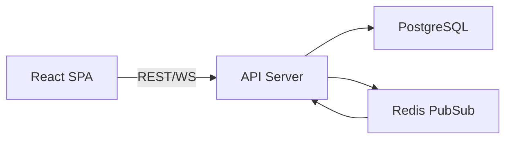
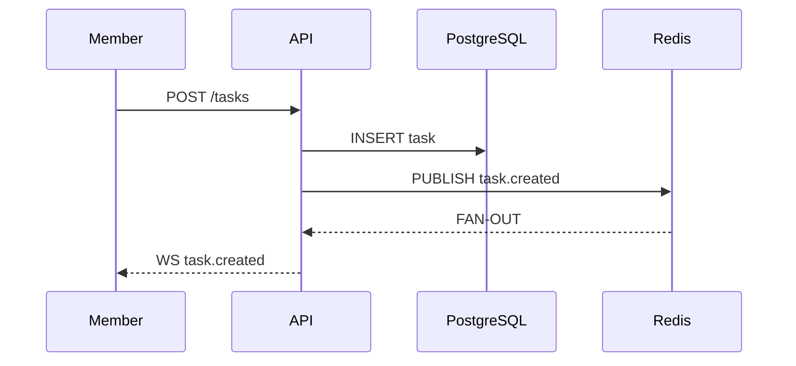

<!-- cpt:#:design -->
# Technical Design: TaskFlow

<!-- cpt:##:architecture-overview -->
## 1. Architecture Overview

<!-- cpt:###:architectural-vision -->
### Architectural Vision

<!-- cpt:architectural-vision-body -->
TaskFlow uses a layered architecture with clear separation of concerns: React SPA frontend, Node.js REST API, and PostgreSQL database. WebSocket connections enable real-time updates for collaborative task management.

The architecture prioritizes simplicity and developer productivity while supporting real-time collaboration. System boundaries are clearly defined between presentation, business logic, and data persistence layers.
<!-- cpt:architectural-vision-body -->
<!-- cpt:###:architectural-vision -->

<!-- cpt:###:architecture-drivers -->
### Architecture drivers

<!-- cpt:####:prd-requirements -->
#### Product requirements

<!-- cpt:fr-title repeat="many" -->
##### Task Management

<!-- cpt:id-ref:fr has="priority,task" -->
- [ ] `p1` - `cpt-taskflow-fr-task-management`
<!-- cpt:id-ref:fr -->

**Solution**: REST API with idempotent endpoints and PostgreSQL persistence for task CRUD.
<!-- cpt:fr-title repeat="many" -->

<!-- cpt:fr-title repeat="many" -->
##### Notifications

<!-- cpt:id-ref:fr has="priority,task" -->
- [ ] `p1` - `cpt-taskflow-fr-notifications`
<!-- cpt:id-ref:fr -->

**Solution**: WebSocket push with Redis PubSub for real-time notification delivery.
<!-- cpt:fr-title repeat="many" -->

<!-- cpt:nfr-title repeat="many" -->
##### Security

<!-- cpt:id-ref:nfr has="priority,task" -->
- [ ] `p1` - `cpt-taskflow-nfr-security`
<!-- cpt:id-ref:nfr -->

**Solution**: JWT authentication with role-based authorization middleware.
<!-- cpt:nfr-title -->

<!-- cpt:nfr-title repeat="many" -->
##### Performance

<!-- cpt:id-ref:nfr has="priority,task" -->
- [ ] `p2` - `cpt-taskflow-nfr-performance`
<!-- cpt:id-ref:nfr -->

**Solution**: Connection pooling and query optimization for sub-500ms responses.
<!-- cpt:nfr-title -->
<!-- cpt:####:prd-requirements -->

<!-- cpt:####:adr-records -->
#### Architecture Decisions Records

<!-- cpt:adr-title repeat="many" -->
##### PostgreSQL for Storage

<!-- cpt:id-ref:adr has="priority,task" -->
- [ ] `p1` - `cpt-taskflow-adr-postgres-storage`
<!-- cpt:id-ref:adr -->

Use PostgreSQL for durable task storage. Chosen for strong ACID guarantees, relational query support, and team expertise. Trade-off: requires separate DB server vs embedded SQLite.
<!-- cpt:adr-title -->
<!-- cpt:####:adr-records -->
<!-- cpt:###:architecture-drivers -->

<!-- cpt:###:architecture-layers -->
### Architecture Layers

<!-- cpt:table:architecture-layers -->
| Layer | Responsibility | Technology |
|-------|---------------|------------|
| Presentation | User interface, state management | React, TypeScript |
| API | REST endpoints, WebSocket handling | Node.js, Express |
| Business Logic | Task operations, authorization | TypeScript |
| Data Access | Database queries, caching | PostgreSQL, Redis |
<!-- cpt:table:architecture-layers -->
<!-- cpt:###:architecture-layers -->
<!-- cpt:##:architecture-overview -->

<!-- cpt:##:principles-and-constraints -->
## 2. Principles & Constraints

<!-- cpt:###:principles -->
### 2.1: Design Principles

<!-- cpt:####:principle-title repeat="many" -->
#### Real-time First

<!-- cpt:id:principle has="priority,task" covered_by="DECOMPOSITION,SPEC" -->
- [ ] `p1` - **ID**: `cpt-taskflow-principle-realtime-first`

<!-- cpt:paragraph:principle-body -->
Prefer architectures that keep task state and notifications consistent and observable for all users. Changes should propagate to all connected clients within 2 seconds.
<!-- cpt:paragraph:principle-body -->
<!-- cpt:id:principle -->
<!-- cpt:####:principle-title repeat="many" -->

<!-- cpt:####:principle-title repeat="many" -->
#### Simplicity over Specs

<!-- cpt:id:principle has="priority,task" covered_by="DECOMPOSITION,SPEC" -->
- [ ] `p2` - **ID**: `cpt-taskflow-principle-simplicity`

<!-- cpt:paragraph:principle-body -->
Choose simpler solutions over spec-rich ones. Avoid premature optimization and unnecessary abstractions. Code should be readable by junior developers.
<!-- cpt:paragraph:principle-body -->
<!-- cpt:id:principle -->
<!-- cpt:####:principle-title repeat="many" -->
<!-- cpt:###:principles -->

<!-- cpt:###:constraints -->
### 2.2: Constraints

<!-- cpt:####:constraint-title repeat="many" -->
#### Supported Platforms

<!-- cpt:id:constraint has="priority,task" covered_by="DECOMPOSITION,SPEC" -->
- [ ] `p1` - **ID**: `cpt-taskflow-constraint-platforms`

<!-- cpt:paragraph:constraint-body -->
Must run on Node.js 18+. PostgreSQL 14+ required for JSONB support. Browser support: last 2 versions of Chrome, Firefox, Safari, Edge.
<!-- cpt:paragraph:constraint-body -->
<!-- cpt:id:constraint -->
<!-- cpt:####:constraint-title repeat="many" -->
<!-- cpt:###:constraints -->
<!-- cpt:##:principles-and-constraints -->

<!-- cpt:##:technical-architecture -->
## 3. Technical Architecture

<!-- cpt:###:domain-model -->
### 3.1: Domain Model

<!-- cpt:paragraph:domain-model -->
Core entities: **Task** (id, title, description, status, priority, dueDate, assigneeId, createdBy, createdAt, updatedAt) and **User** (id, email, name, role). Task status follows state machine: TODO -> IN_PROGRESS -> DONE. Invariants: assignee must be team member, due date must be future.
<!-- cpt:paragraph:domain-model -->
<!-- cpt:###:domain-model -->

<!-- cpt:###:component-model -->
### 3.2: Component Model

<!-- cpt:code:component-model -->

<!-- cpt:code:component-model -->

<!-- cpt:####:component-title repeat="many" -->
#### API Server

<!-- cpt:id:component has="priority,task" covered_by="DECOMPOSITION,SPEC" -->
- [ ] `p1` - **ID**: `cpt-taskflow-component-api-server`

<!-- cpt:list:component-payload -->
- Responsibilities: Handle HTTP requests, enforce authorization, coordinate business logic
- Boundaries: Exposes REST API and WebSocket endpoint, no direct database access from handlers
- Dependencies: Express, pg-pool, ioredis
- Key interfaces: TaskController, AuthMiddleware, WebSocketManager
<!-- cpt:list:component-payload -->
<!-- cpt:id:component -->
<!-- cpt:####:component-title repeat="many" -->
<!-- cpt:###:component-model -->

<!-- cpt:###:api-contracts -->
### 3.3: API Contracts

<!-- cpt:paragraph:api-contracts -->
REST API at `/api/v1/` with JSON request/response. Authentication via Bearer JWT token. Standard endpoints: `POST /tasks`, `GET /tasks`, `PATCH /tasks/:id`, `DELETE /tasks/:id`. WebSocket at `/ws` for real-time events: `task.created`, `task.updated`, `task.deleted`.
<!-- cpt:paragraph:api-contracts -->
<!-- cpt:###:api-contracts -->

<!-- cpt:###:interactions -->
### 3.4: Interactions & Sequences

<!-- cpt:####:sequence-title repeat="many" -->
#### Create Task Flow

<!-- cpt:id:seq has="priority,task" covered_by="DECOMPOSITION,SPEC" -->
- [ ] `p1` - **ID**: `cpt-taskflow-seq-create-task`

<!-- cpt:code:sequences -->

<!-- cpt:code:sequences -->

<!-- cpt:paragraph:sequence-body -->
Lead or member creates task via REST API. Server validates input, inserts into database, then publishes event to Redis for real-time distribution. All connected clients receive WebSocket notification within 2 seconds.
<!-- cpt:paragraph:sequence-body -->
<!-- cpt:id:seq -->
<!-- cpt:####:sequence-title repeat="many" -->
<!-- cpt:###:interactions -->

<!-- cpt:###:database -->
### 3.5 Database schemas & tables (optional)

<!-- cpt:####:db-table-title repeat="many" -->
#### Table tasks

<!-- cpt:id:dbtable has="priority,task" covered_by="DECOMPOSITION,SPEC" -->
- [ ] `p1` - **ID**: `cpt-taskflow-dbtable-tasks`

Schema
<!-- cpt:table:db-table-schema -->
| Column | Type | Description |
|--------|------|-------------|
| id | uuid | Task ID (PK) |
| title | text | Task title (required) |
| description | text | Task description |
| status | enum | TODO, IN_PROGRESS, DONE |
| assignee_id | uuid | FK to users.id |
<!-- cpt:table:db-table-schema -->

PK: `id`

Constraints: `status IN ('TODO', 'IN_PROGRESS', 'DONE')`, `assignee_id REFERENCES users(id)`

Example
<!-- cpt:table:db-table-example -->
| id | title | status |
|----|-------|--------|
| 550e8400... | Implement login | IN_PROGRESS |
<!-- cpt:table:db-table-example -->
<!-- cpt:id:dbtable -->
<!-- cpt:####:db-table-title repeat="many" -->
<!-- cpt:###:database -->

<!-- cpt:###:topology -->
### 3.6: Topology (optional)

<!-- cpt:id:topology has="task" -->
- [ ] **ID**: `cpt-taskflow-topology-local`

<!-- cpt:free:topology-body -->
Local development: React SPA (port 3000) + API server (port 4000) + PostgreSQL (port 5432) + Redis (port 6379) on single machine. Production: Kubernetes deployment with horizontal scaling of API pods.
<!-- cpt:free:topology-body -->
<!-- cpt:id:topology -->
<!-- cpt:###:topology -->

<!-- cpt:###:tech-stack -->
### 3.7: Tech stack (optional)

<!-- cpt:paragraph:status -->
**Status**: Accepted
<!-- cpt:paragraph:status -->

<!-- cpt:paragraph:tech-body -->
Backend: Node.js 18 LTS, TypeScript 5.x, Express 4.x, pg-pool for PostgreSQL, ioredis for Redis. Frontend: React 18, TypeScript, Vite build tool. Testing: Jest, React Testing Library. Rationale: Team familiarity, mature ecosystem, strong TypeScript support.
<!-- cpt:paragraph:tech-body -->
<!-- cpt:###:tech-stack -->
<!-- cpt:##:technical-architecture -->

<!-- cpt:##:design-context -->
## 4. Additional Context

<!-- cpt:free:design-context-body -->
TaskFlow prioritizes real-time collaboration and predictable REST semantics. Future considerations include mobile app support and Slack integration. Trade-offs accepted: PostgreSQL requires operational overhead vs SQLite simplicity.
<!-- cpt:free:design-context-body -->

<!-- cpt:paragraph:date -->
**Date**: 2025-01-15
<!-- cpt:paragraph:date -->
<!-- cpt:##:design-context -->

<!-- cpt:#:design -->
