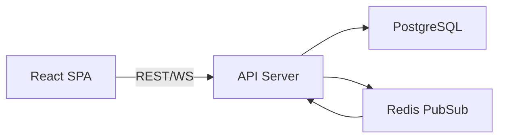
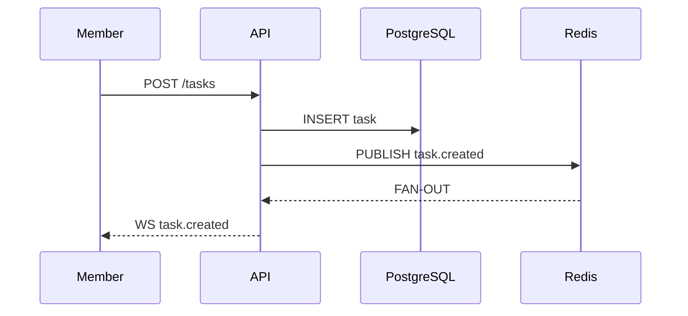

# Technical Design: TaskFlow

## 1. Architecture Overview

### Architectural Vision

TaskFlow uses a layered architecture with clear separation of concerns: React SPA frontend, Node.js REST API, and PostgreSQL database. WebSocket connections enable real-time updates for collaborative task management.

The architecture prioritizes simplicity and developer productivity while supporting real-time collaboration. System boundaries are clearly defined between presentation, business logic, and data persistence layers.

### Architecture drivers

#### Product requirements

##### Task Management

- [ ] `p1` - `cpt-ex-task-flow-fr-task-management`

**Solution**: REST API with idempotent endpoints and PostgreSQL persistence for task CRUD.

##### Notifications

- [ ] `p1` - `cpt-ex-task-flow-fr-notifications`

**Solution**: WebSocket push with Redis PubSub for real-time notification delivery.

##### Security

- [ ] `p1` - `cpt-ex-task-flow-nfr-security`

**Solution**: JWT authentication with role-based authorization middleware.

##### Performance

- [ ] `p2` - `cpt-ex-task-flow-nfr-performance`

**Solution**: Connection pooling and query optimization for sub-500ms responses.

#### Architecture Decisions Records

##### PostgreSQL for Storage

- [ ] `p1` - `cpt-ex-task-flow-adr-postgres-storage`

Use PostgreSQL for durable task storage. Chosen for strong ACID guarantees, relational query support, and team expertise. Trade-off: requires separate DB server vs embedded SQLite.

### Architecture Layers

| Layer | Responsibility | Technology |
|-------|---------------|------------|
| Presentation | User interface, state management | React, TypeScript |
| API | REST endpoints, WebSocket handling | Node.js, Express |
| Business Logic | Task operations, authorization | TypeScript |
| Data Access | Database queries, caching | PostgreSQL, Redis |

## 2. Principles & Constraints

### 2.1 Design Principles

#### Real-time First

- [ ] `p1` - **ID**: `cpt-ex-task-flow-principle-realtime-first`

Prefer architectures that keep task state and notifications consistent and observable for all users. Changes should propagate to all connected clients within 2 seconds.

#### Simplicity over Specs

- [ ] `p2` - **ID**: `cpt-ex-task-flow-principle-simplicity`

Choose simpler solutions over spec-rich ones. Avoid premature optimization and unnecessary abstractions. Code should be readable by junior developers.

### 2.2 Constraints

#### Supported Platforms

- [ ] `p1` - **ID**: `cpt-ex-task-flow-constraint-platforms`

Must run on Node.js 18+. PostgreSQL 14+ required for JSONB support. Browser support: last 2 versions of Chrome, Firefox, Safari, Edge.

## 3. Technical Architecture

### 3.1 Domain Model

Core entities: **Task** (id, title, description, status, priority, dueDate, assigneeId, createdBy, createdAt, updatedAt) and **User** (id, email, name, role). Task status follows state machine: TODO -> IN_PROGRESS -> DONE. Invariants: assignee must be team member, due date must be future.

### 3.2 Component Model

#### API Server

- [ ] `p1` - **ID**: `cpt-ex-task-flow-component-api-server`

- Responsibilities: Handle HTTP requests, enforce authorization, coordinate business logic
- Boundaries: Exposes REST API and WebSocket endpoint, no direct database access from handlers
- Dependencies: Express, pg-pool, ioredis
- Key interfaces: TaskController, AuthMiddleware, WebSocketManager

### 3.3 API Contracts

REST API at `/api/v1/` with JSON request/response. Authentication via Bearer JWT token. Standard endpoints: `POST /tasks`, `GET /tasks`, `PATCH /tasks/:id`, `DELETE /tasks/:id`. WebSocket at `/ws` for real-time events: `task.created`, `task.updated`, `task.deleted`.

### 3.4 Internal Dependencies

None.

### 3.5 External Dependencies

None.

### 3.6 Interactions & Sequences

#### Create Task Flow

- [ ] `p1` - **ID**: `cpt-ex-task-flow-seq-create-task`

Lead or member creates task via REST API. Server validates input, inserts into database, then publishes event to Redis for real-time distribution. All connected clients receive WebSocket notification within 2 seconds.

### 3.7 Database schemas & tables

#### Table tasks

- [ ] `p1` - **ID**: `cpt-ex-task-flow-dbtable-tasks`

Schema

| Column | Type | Description |
|--------|------|-------------|
| id | uuid | Task ID (PK) |
| title | text | Task title (required) |
| description | text | Task description |
| status | enum | TODO, IN_PROGRESS, DONE |
| assignee_id | uuid | FK to users.id |

PK: `id`

Constraints: `status IN ('TODO', 'IN_PROGRESS', 'DONE')`, `assignee_id REFERENCES users(id)`

Example

| id | title | status |
|----|-------|--------|
| 550e8400... | Implement login | IN_PROGRESS |

### 3.6: Topology (optional)

- [ ] **ID**: `cpt-ex-task-flow-topology-local`

Local development: React SPA (port 3000) + API server (port 4000) + PostgreSQL (port 5432) + Redis (port 6379) on single machine. Production: Kubernetes deployment with horizontal scaling of API pods.

### 3.7: Tech stack (optional)

**Status**: Accepted

Backend: Node.js 18 LTS, TypeScript 5.x, Express 4.x, pg-pool for PostgreSQL, ioredis for Redis. Frontend: React 18, TypeScript, Vite build tool. Testing: Jest, React Testing Library. Rationale: Team familiarity, mature ecosystem, strong TypeScript support.

## 4. Additional Context

TaskFlow prioritizes real-time collaboration and predictable REST semantics. Future considerations include mobile app support and Slack integration. Trade-offs accepted: PostgreSQL requires operational overhead vs SQLite simplicity.

**Date**: 2025-01-15

