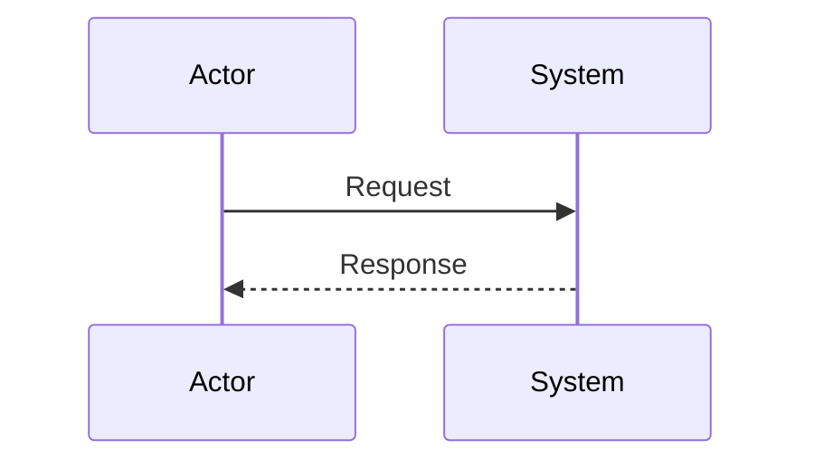
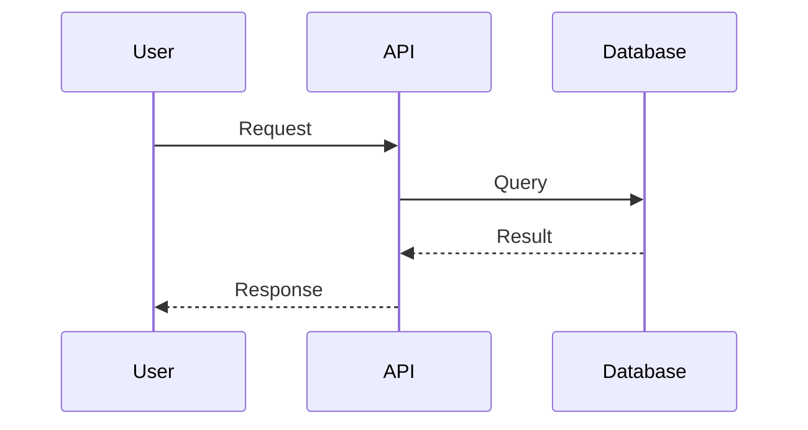

<!-- spd:#:design -->
# Technical Design: {PROJECT_NAME}

<!-- spd:##:architecture-overview -->
## 1. Architecture Overview

<!-- spd:###:architectural-vision -->
### Architectural Vision

<!-- spd:architectural-vision-body -->
{1-3 paragraphs describing the architecture at a high level.}

{Include:
- system boundaries
- major responsibilities
- what drives the chosen architecture}
<!-- spd:architectural-vision-body -->
<!-- spd:###:architectural-vision -->

<!-- spd:###:architecture-drivers -->
### Architecture drivers

<!-- spd:####:prd-requirements -->
#### Product requirements

<!-- spd:fr-title repeat="many" -->

##### {FR Name 1}

<!-- spd:id-ref:fr has="priority,task" -->
- [ ] `p1` - `spd-{system}-fr-{slug}`
<!-- spd:id-ref:fr -->

**Solution**: {How the design addresses this requirement}

##### {FR Name 2}

<!-- spd:id-ref:fr has="priority,task" -->
- [ ] `p2` - `spd-{system}-fr-{slug}`
<!-- spd:id-ref:fr -->

**Solution**: {How the design addresses this requirement}

<!-- spd:fr-title repeat="many" -->

<!-- spd:nfr-title repeat="many" -->

##### {NFR Name 1}

<!-- spd:id-ref:nfr has="priority,task" -->
- [ ] `p1` - `spd-{system}-nfr-{slug}`
<!-- spd:id-ref:nfr -->

**Solution**: {How the design addresses this NFR}

##### {NFR Name 2}

<!-- spd:id-ref:nfr has="priority,task" -->
- [ ] `p2` - `spd-{system}-nfr-{slug}`
<!-- spd:id-ref:nfr -->

**Solution**: {How the design addresses this NFR}

<!-- spd:nfr-title repeat="many" -->
<!-- spd:####:prd-requirements -->

<!-- spd:####:adr-records -->
#### Architecture Decisions Records

<!-- spd:adr-title repeat="many" -->

##### {ADR Title 1}

<!-- spd:id-ref:adr has="priority,task" -->
- [ ] `p1` - `spd-{system}-adr-{slug}`
<!-- spd:id-ref:adr -->

{2-4 sentences describing what decision was taken and why. Include key tradeoffs if relevant.}

##### {ADR Title 2}

<!-- spd:id-ref:adr has="priority,task" -->
- [ ] `p2` - `spd-{system}-adr-{slug}`
<!-- spd:id-ref:adr -->

{2-4 sentences describing what decision was taken and why. Include key tradeoffs if relevant.}

<!-- spd:adr-title repeat="many" -->
<!-- spd:####:adr-records -->
<!-- spd:###:architecture-drivers -->

<!-- spd:###:architecture-layers -->
### Architecture Layers

<!-- spd:table:architecture-layers -->
| Layer | Responsibility | Technology |
|-------|---------------|------------|
| {layer 1} | {responsibility} | {tech} |
| {layer 2} | {responsibility} | {tech} |
| {layer 3} | {responsibility} | {tech} |
<!-- spd:table:architecture-layers -->
<!-- spd:###:architecture-layers -->
<!-- spd:##:architecture-overview -->

<!-- spd:##:principles-and-constraints -->
## 2. Principles & Constraints

<!-- spd:###:principles -->
### 2.1: Design Principles

<!-- spd:####:principle-title repeat="many" -->

#### {Principle Name 1}

<!-- spd:id:principle has="priority,task" covered_by="DECOMPOSITION,SPEC" -->
- [ ] `p1` - **ID**: `spd-{system}-principle-{slug}`

<!-- spd:paragraph:principle-body -->
{Rationale and guidance for this principle.}
<!-- spd:paragraph:principle-body -->
<!-- spd:id:principle -->

#### {Principle Name 2}

<!-- spd:id:principle has="priority,task" covered_by="DECOMPOSITION,SPEC" -->
- [ ] `p2` - **ID**: `spd-{system}-principle-{slug}`

<!-- spd:paragraph:principle-body -->
{Rationale and guidance for this principle.}
<!-- spd:paragraph:principle-body -->
<!-- spd:id:principle -->

<!-- spd:####:principle-title repeat="many" -->
<!-- spd:###:principles -->

<!-- spd:###:constraints -->
### 2.2: Constraints

<!-- spd:####:constraint-title repeat="many" -->

#### {Constraint Name 1}

<!-- spd:id:constraint has="priority,task" covered_by="DECOMPOSITION,SPEC" -->
- [ ] `p1` - **ID**: `spd-{system}-constraint-{slug}`

<!-- spd:paragraph:constraint-body -->
{What constraint exists and why.}
<!-- spd:paragraph:constraint-body -->
<!-- spd:id:constraint -->

#### {Constraint Name 2}

<!-- spd:id:constraint has="priority,task" covered_by="DECOMPOSITION,SPEC" -->
- [ ] `p2` - **ID**: `spd-{system}-constraint-{slug}`

<!-- spd:paragraph:constraint-body -->
{What constraint exists and why.}
<!-- spd:paragraph:constraint-body -->
<!-- spd:id:constraint -->

<!-- spd:####:constraint-title repeat="many" -->
<!-- spd:###:constraints -->
<!-- spd:##:principles-and-constraints -->

<!-- spd:##:technical-architecture -->
## 3. Technical Architecture

<!-- spd:###:domain-model -->
### 3.1: Domain Model

<!-- spd:paragraph:domain-model -->
{Describe domain entities, invariants, and relationships.}
<!-- spd:paragraph:domain-model -->
<!-- spd:###:domain-model -->

<!-- spd:###:component-model -->
### 3.2: Component Model

<!-- spd:code:component-model -->
```mermaid
%% Add component diagram here
```
<!-- spd:code:component-model -->

<!-- spd:####:component-title repeat="many" -->

#### {Component Name 1}

<!-- spd:id:component has="priority,task" covered_by="DECOMPOSITION,SPEC" -->
- [ ] `p1` - **ID**: `spd-{system}-component-{slug}`

<!-- spd:list:component-payload -->
- **Responsibilities**: {what this component does}
- **Boundaries**: {what is in/out of scope}
- **Dependencies**: {other components it depends on}
- **Key interfaces**: {public API or contracts}
<!-- spd:list:component-payload -->
<!-- spd:id:component -->

#### {Component Name 2}

<!-- spd:id:component has="priority,task" covered_by="DECOMPOSITION,SPEC" -->
- [ ] `p2` - **ID**: `spd-{system}-component-{slug}`

<!-- spd:list:component-payload -->
- **Responsibilities**: {what this component does}
- **Boundaries**: {what is in/out of scope}
- **Dependencies**: {other components it depends on}
- **Key interfaces**: {public API or contracts}
<!-- spd:list:component-payload -->
<!-- spd:id:component -->

<!-- spd:####:component-title repeat="many" -->
<!-- spd:###:component-model -->

<!-- spd:###:api-contracts -->
### 3.3: API Contracts

<!-- spd:paragraph:api-contracts -->
{Describe public APIs, contracts, and integration boundaries.}
<!-- spd:paragraph:api-contracts -->
<!-- spd:###:api-contracts -->

<!-- spd:###:interactions -->
### 3.4: Interactions & Sequences

<!-- spd:####:sequence-title repeat="many" -->

#### {Sequence Name 1}

<!-- spd:id:seq has="priority,task" covered_by="DECOMPOSITION,SPEC" -->
- [ ] `p1` - **ID**: `spd-{system}-seq-{slug}`

<!-- spd:code:sequences -->

<!-- spd:code:sequences -->

<!-- spd:paragraph:sequence-body -->
{Explain the interaction, participants, and success/failure outcomes.}
<!-- spd:paragraph:sequence-body -->
<!-- spd:id:seq -->

#### {Sequence Name 2}

<!-- spd:id:seq has="priority,task" covered_by="DECOMPOSITION,SPEC" -->
- [ ] `p2` - **ID**: `spd-{system}-seq-{slug}`

<!-- spd:code:sequences -->

<!-- spd:code:sequences -->

<!-- spd:paragraph:sequence-body -->
{Explain the interaction, participants, and success/failure outcomes.}
<!-- spd:paragraph:sequence-body -->
<!-- spd:id:seq -->

<!-- spd:####:sequence-title repeat="many" -->
<!-- spd:###:interactions -->

<!-- spd:###:database -->
### 3.5 Database schemas & tables (optional)

<!-- spd:####:db-table-title repeat="many" -->

#### Table {name 1}

<!-- spd:id:dbtable has="priority,task" covered_by="DECOMPOSITION,SPEC" -->
- [ ] `p1` - **ID**: `spd-{system}-dbtable-{slug}`

**Schema**
<!-- spd:table:db-table-schema -->
| Column | Type | Description |
|--------|------|-------------|
| id | UUID | Primary key |
| name | VARCHAR(255) | Display name |
| created_at | TIMESTAMP | Creation timestamp |
<!-- spd:table:db-table-schema -->

**PK**: id

**Constraints**: name must be unique

**Additional info**: {Any additional info}

**Example**
<!-- spd:table:db-table-example -->
| id | name | created_at |
|----|------|------------|
| abc-123 | Example | 2024-01-01 |
<!-- spd:table:db-table-example -->
<!-- spd:id:dbtable -->

#### Table {name 2}

<!-- spd:id:dbtable has="priority,task" covered_by="DECOMPOSITION,SPEC" -->
- [ ] `p2` - **ID**: `spd-{system}-dbtable-{slug}`

**Schema**
<!-- spd:table:db-table-schema -->
| Column | Type | Description |
|--------|------|-------------|
| id | UUID | Primary key |
| status | VARCHAR(50) | Current status |
| updated_at | TIMESTAMP | Last update |
<!-- spd:table:db-table-schema -->

**PK**: id

**Constraints**: status must be one of: active, inactive, pending

**Additional info**: {Any additional info}

**Example**
<!-- spd:table:db-table-example -->
| id | status | updated_at |
|----|--------|------------|
| xyz-456 | active | 2024-01-15 |
<!-- spd:table:db-table-example -->
<!-- spd:id:dbtable -->

<!-- spd:####:db-table-title repeat="many" -->
<!-- spd:###:database -->

<!-- spd:###:topology -->
### 3.6: Topology (optional)

<!-- spd:id:topology has="task" -->
- [ ] **ID**: `spd-{system}-topology-{slug}`

<!-- spd:free:topology-body -->
{ Physical view, files, pods, containers, DC, virtual machines, etc. }
<!-- spd:free:topology-body -->
<!-- spd:id:topology -->
<!-- spd:###:topology -->

<!-- spd:###:tech-stack -->
### 3.7: Tech stack (optional)

<!-- spd:paragraph:status -->
**Status**: Proposed | Rejected | Accepted | Deprecated | Superseded
<!-- spd:paragraph:status -->

<!-- spd:paragraph:tech-body -->
{Describe tech choices and rationale.}
<!-- spd:paragraph:tech-body -->
<!-- spd:###:tech-stack -->
<!-- spd:##:technical-architecture -->

<!-- spd:##:design-context -->
## 4. Additional Context

<!-- spd:free:design-context-body -->
{Optional notes, rationale, trade-offs, and links.}
<!-- spd:free:design-context-body -->

<!-- spd:paragraph:date -->
**Date**: {YYYY-MM-DD}
<!-- spd:paragraph:date -->
<!-- spd:##:design-context -->

<!-- spd:#:design -->
